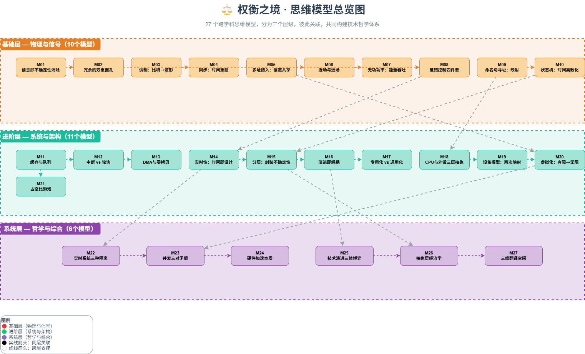

# ⚖️ weighing-the-world – 思维模型武器库

> 用 27 个跨学科思维模型，更清醒地「称量」这个世界。

## 🗺️ 卡片总览

## 📚 卡片列表

| 编号 | 模型名称 | 简要说明 |
|------|----------|----------|
| M01 | 信息熵 | 不确定性、信息量与系统混乱度 |
| M02 | 冗余与对偶 | 安全边际与互补视角 |
| ...  | ...      | ...      |
| M27 | 三个维度 | 系统性思考的立体框架 |

## 🗂️ 目录说明

- `cards/` – 每个模型一篇 Markdown 文章（M01~M27）
- `images/` – 每张卡片的配图（PNG）
- `templates/` – 卡片模板，方便统一格式
- `discussions/` – 讨论记录 / 链接

## 🧩 如何使用

1. 直接浏览 `cards/` 下的文件，按编号或主题阅读。
2. 每张卡片都配有图示，建议先看图再读文字。
3. 如果想参与讨论某个模型，请到 [Issues](../../issues) 新建话题，标签选择对应模型编号。

## 🛠️ 贡献指南

欢迎补充案例、修正描述或新增图示。请先阅读 `templates/card_template.md` 保持格式统一。

