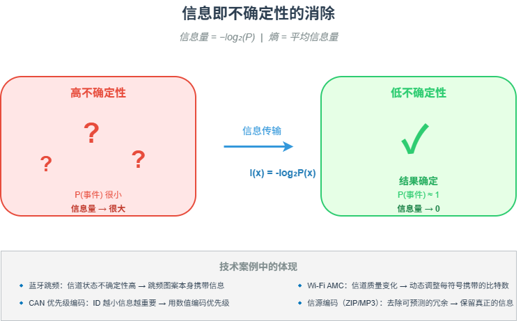

# M01 信息即不确定性的消除

> 信息量 = 被消除的不确定性。越出乎意料的事件，携带的信息量越大。

## 🧠 核心概念

香农信息论给出了一个反直觉的结论：**信息与不确定性（随机性）牢牢绑定**。一个必然发生的事件（太阳明天升起）不带来任何信息；而一个极小概率的事件（明天市区下陨石雨）会带来巨大的信息量。

数学上，信息量定义为 \( I(x) = -\log_2 P(x) \)，熵则是所有可能事件信息量的期望：\( H = -\sum P(x)\log_2 P(x) \)。

这一概念揭示了通信系统的本质：**用可控的冗余对抗不可控的干扰**，从而在不确定的物理世界中传输确定的信息。

## 🖼️ 图示

*上图展示了从“高不确定性”（低概率事件）到“低不确定性”（高概率事件）的信息量变化过程，并标注了蓝牙、CAN、Wi-Fi 等技术案例。*

## ⚙️ 如何应用

### 场景1：通信协议设计

- **蓝牙跳频**：信道状态高度不确定 → 跳频图案本身携带信息，接收端必须同步才能解调。
- **CAN 优先级编码**：ID 数值越小优先级越高 → 用数值编码信息的“重要性”。
- **Wi-Fi AMC**：根据信道质量动态调整调制阶数 → 在不确定环境中最大化有效信息率。

### 场景2：产品与体验设计

- 用户对“惊喜功能”的感知 = 功能的信息量。过于平庸的功能（高概率）用户无感；过度“奇葩”的功能（概率极低）可能变成困惑。
- 新手引导应降低不确定性（高概率提示），而高级功能可以适度保留“探索惊喜”。

### 场景3：知识学习

- 重复学习已知内容的信息量为零。真正高效的学习是接触“你刚好不知道、但能理解”的内容 —— 对应信息论中的“适度不确定性”。

## 🔗 相关模型

- **M02 冗余的双重面孔**：信源编码去除冗余（提效率），信道编码添加冗余（保可靠）
- **M04 同步：接收端的时间重建**：如何在噪声中恢复信息

## 💬 思考题

1. 为什么“太阳明天从东边升起”这句话的信息量为零？
2. 抛一枚均匀硬币，出现正面的信息量是 1 比特。如果硬币不均匀（正面概率 0.9），出现正面的信息量是多少？出现反面呢？
3. 蓝牙跳频和 CAN 优先级编码，分别是用哪种方式“创造信息”？

---
*创建日期：2026-04-18*  
*最后更新：2026-04-18*
