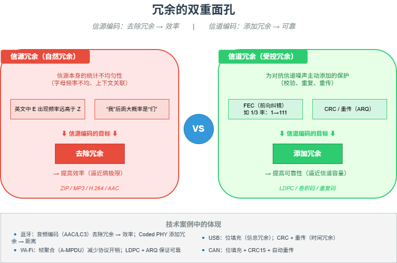

# M02 冗余的双重面孔

> 信源编码去除自然冗余（提效率），信道编码添加受控冗余（保可靠）。

## 🧠 核心概念

冗余在通信系统中具有双重角色，甚至相反的角色：

- **信源冗余**：信源本身固有的统计不均匀性（如字母E出现频率远高于Z）。这种冗余是“自然的”，信源编码（ZIP、MP3、H.264）的目标就是**去除**它，以提升传输或存储效率。
- **信道冗余**：为了对抗信道噪声而主动添加的保护信息（如FEC、CRC、重传）。这种冗余是“受控的”，信道编码的目标就是**添加**它，以提升传输可靠性。

一个优秀的通信系统，本质上就是在效率和可靠性之间寻找最佳的平衡点。香农信息论告诉我们：信源编码逼近熵（理论极限），信道编码逼近信道容量。

## 🖼️ 图示

*上图展示了信源冗余（左侧）与信道冗余（右侧）的对比，以及它们在不同技术中的体现。*

## ⚙️ 如何应用

### 场景1：通信协议设计
- **蓝牙**：音频编码去除冗余（SBC/LC3），同时使用1/3率FEC或Coded PHY添加冗余以对抗干扰。
- **Wi-Fi**：信源端帧聚合（A-MPDU）减少协议开销，物理层使用LDPC卷积码添加冗余，MAC层使用ARQ重传。
- **USB**：NRZI编码+位填充（保证时钟同步）是一种信息冗余；CRC和重传是时间冗余。
- **CAN**：位填充（连续5个相同位后插入反相位）是信息冗余；15位CRC和自动重传是时间冗余。

### 场景2：系统设计（可靠性工程）
- **冗余磁盘阵列（RAID）**：通过添加校验盘（信息冗余）来容忍磁盘故障。
- **分布式系统**：数据多副本存储（空间冗余）和重试机制（时间冗余）保证可用性。
- **软件工程**：代码中的断言和日志（信息冗余）帮助定位错误；重试框架（时间冗余）应对瞬时故障。

### 场景3：认知与决策
- **交叉验证**：用不同方法验证同一结论（空间冗余）提高置信度。
- **反复核对**：重要决策前多次检查（时间冗余）降低出错概率。

## 🔗 相关模型
- **M01 信息即不确定性的消除**：冗余与信息量成反比
- **M08 差错控制四件套**：冗余是四件套之首
- **M21 占空比游戏**：时间冗余（重传）会增加占空比

## 💬 思考题
1. 为什么信源编码和信道编码对冗余的态度完全相反？
2. 蓝牙的Coded PHY通过重复编码将速率从1Mbps降到125kbps，传输距离增加2-4倍。这是用哪种冗余换取了什么？
3. 你工作中遇到过“过度冗余”导致效率低下的例子吗？如何平衡？

---
*创建日期：2026-04-18*  
*最后更新：2026-04-18*