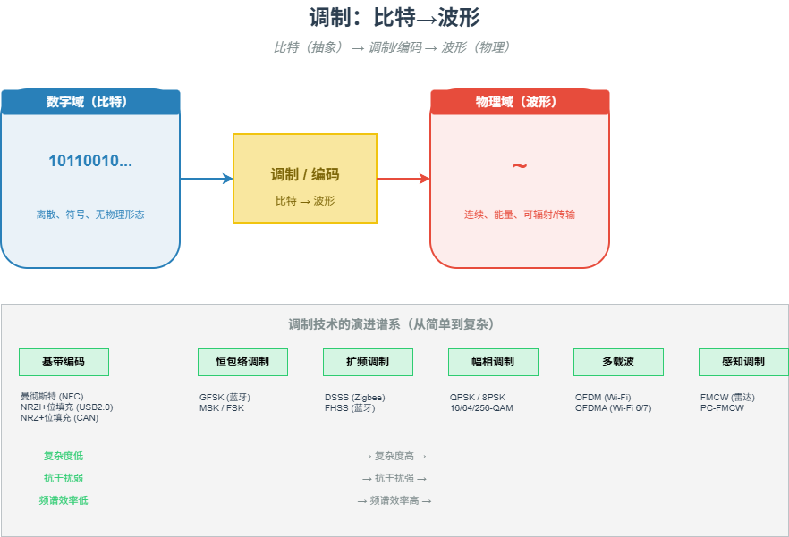

# M03 调制：比特→波形

> 比特是抽象的，波形是真实的。调制与编码，正是连接这两个世界的翻译官。

## 🧠 核心概念

调制与编码将数字比特转换为适合信道传输的物理信号。一个物理信号要胜任传输任务，通常需要满足四个条件：

1. **匹配信道特性**：无线信道需要高频载波才能有效辐射，有线信道可以直接传输基带信号。
2. **抗干扰能力**：信号在传输中会遇到噪声、衰减和多径效应，需要一定的鲁棒性。
3. **频谱效率**：在有限的带宽内，尽可能多地塞进比特。
4. **同步能力**：接收端需要能从信号中恢复时钟，从而准确地采样。

不同技术对这四项条件的权重取舍，造就了千姿百态的调制编码方案。从简单的基带编码（曼彻斯特、NRZI）到复杂的通带调制（QAM、OFDM），再到感知领域的调频连续波（FMCW），本质都是在做同一件事：**在物理世界的约束下，为比特寻找最高效、最可靠的“物理载体”**。

## 🖼️ 图示

*上图展示了从基带编码到通带调制的演进路径，以及不同技术在选择调制方案时的核心取舍。*

## ⚙️ 如何应用

### 场景1：有线通信（基带编码）
- **USB 2.0**：NRZI + 位填充。电平翻转表示0，不变表示1；连续6个1后强制插入0。用可控开销（约20%）换取时钟同步的可靠性。
- **NFC**：曼彻斯特编码。每个比特周期内电平跳变，时钟和数据捆绑，接收端可简单恢复时钟。
- **CAN**：NRZ + 位填充。差分信号 + 非破坏性位仲裁，在物理层直接解决优先级冲突。

### 场景2：无线通信（通带调制）
- **蓝牙**：GFSK（高斯频移键控）。恒包络调制，对非线性放大器不敏感，功耗低，实现简单。EDR模式引入PSK提高速率。
- **Wi-Fi**：OFDM + QAM。将高速数据流分割到多个正交子载波上并行传输，抵抗多径效应。QAM阶数（64/256/1024）随信噪比动态调整。
- **Zigbee**：O-QPSK + DSSS。直接序列扩频，用带宽换信噪比，在低功耗下实现可靠传输。

### 场景3：感知系统（FMCW雷达）
- **调频连续波**：发射线性调频信号（chirp），接收回波后混频得到差频，频率与目标距离成正比。
- **相位编码（PC-FMCW）**：为每个雷达叠加相位编码（如GMSK），实现多雷达共存时的互干扰抑制。

### 场景4：设计决策
- **有线 vs 无线**：有线信道可控 → 简单基带编码；无线信道复杂 → 复杂通带调制 + 扩频/跳频。
- **速率 vs 距离**：高阶QAM追求速率但要求高信噪比（短距）；低阶调制（BPSK）鲁棒但速率低（长距）。
- **功耗 vs 性能**：恒包络调制（GFSK）允许非线性功放，功耗低；QAM需要线性功放，功耗高。

## 🔗 相关模型
- **M01 信息即不确定性的消除**：调制将比特映射到波形，本质上是在物理不确定性中编码信息。
- **M02 冗余的双重面孔**：位填充、循环前缀（CP）都是受控冗余，用于保证同步和抗多径。
- **M04 同步：时间重建**：调制决定了接收端如何恢复时钟和数据。
- **M06 近场与远场**：近场（NFC）用简单ASK/曼彻斯特，远场（Wi-Fi）用复杂OFDM/QAM。

## 💬 思考题
1. 为什么USB 2.0要用NRZI+位填充，而不直接用曼彻斯特编码？
2. Wi-Fi为什么不用简单的QAM，而要用OFDM-QAM？OFDM解决了什么根本问题？
3. 如果让你设计一个水下声学通信系统（信道极差、带宽极窄），你会选择哪种调制方式？为什么？

---
*创建日期：2026-04-18*  
*最后更新：2026-04-18*