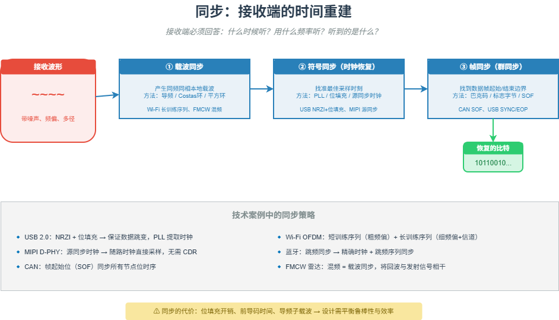

# M04 同步：接收端的时间重建

> 接收端必须在噪声中回答三个问题：什么时候听？用什么频率听？听到的是什么？

## 🧠 核心概念

同步是接收端的第一道关卡。发送端和接收端是两个独立的系统，它们的时钟频率和相位不可能天然一致。没有同步，一切都是空中楼阁。

同步分为三个层次：

- **载波同步**：产生与发送载波同频同相的本地载波，用于相干解调。方法包括导频法（外同步）和平方环/Costas环（自同步）。
- **符号同步（时钟恢复）**：找准每个符号的最佳采样时刻。方法包括外同步（发送时钟导频）和自同步（从数据跳变中提取，如 USB 的位填充）。
- **帧同步（群同步）**：找到一帧数据的起始和结束边界。方法包括集中插入法（如巴克码）和分散插入法。

同步的精度直接影响误码率。现代通信系统（如 Wi-Fi 的 OFDM）还需要精细的载波频偏估计和补偿，因为频偏会破坏子载波的正交性。

## 🖼️ 图示

*上图展示了从接收波形到同步输出的三个层次：载波同步、符号同步、帧同步，并标注了关键技术案例。*

## ⚙️ 如何应用

### 场景1：有线通信的时钟恢复
- **USB 2.0**：NRZI + 位填充。数据流中保证足够多的跳变，接收端 PLL（锁相环）从跳变沿提取时钟。没有位填充，连续 1 会导致失步。
- **MIPI D-PHY**：源同步时钟。发送端随数据提供一对差分时钟，接收端直接用该时钟采样，无需 CDR（时钟数据恢复）。适用于极短距离板内传输。
- **曼彻斯特编码（NFC/USB 低速）**：每个比特中间都有跳变，时钟天然嵌入数据，接收端可极其简单地恢复时钟。

### 场景2：无线通信的同步
- **Wi-Fi OFDM**：前导码中的短训练序列用于粗频偏估计和帧检测，长训练序列用于细频偏校正和信道估计。频偏会破坏子载波正交性，必须精确补偿。
- **蓝牙**：跳频同步。接收端必须与发送端以 1600 跳/秒的速度同步跳频图案。依赖精确的时钟和跳频序列同步。
- **FMCW 雷达**：虽然不是通信，但接收端通过混频（相当于载波同步）将回波与发射信号相乘，得到差频信号，从而测距。

### 场景3：帧同步与边界检测
- **CAN 总线**：帧起始位（SOF）显性位，用于同步总线上所有节点的位时序。
- **USB 包结构**：每个包有同步字段（SYNC）、包标识符（PID）和包结尾（EOP），接收端通过这些字段实现包同步。
- **HDLC/PPP**：使用标志字节 0x7E 作为帧边界，通过比特填充避免标志误判。

### 场景4：同步的性能代价
- **开销**：位填充（USB 2.0 约 20% 开销）、前导码（Wi-Fi 约 10~20 μs 时间开销）、导频子载波（OFDM 中约 10% 子载波用于导频）。
- **权衡**：同步越鲁棒，开销越大；同步越简单，失锁风险越高。设计需根据信道特性和应用场景平衡。

## 🔗 相关模型
- **M01 信息即不确定性的消除**：同步消除了时间和频率的不确定性，使信息得以恢复。
- **M02 冗余的双重面孔**：位填充、前导码都是受控冗余，用于换取同步可靠性。
- **M03 调制：比特→波形**：调制决定了接收端需要何种同步策略（如相干解调需要载波同步）。
- **M08 差错控制四件套**：同步是差错控制的第一步，没有同步，后续纠错无从谈起。

## 💬 思考题
1. USB 2.0 为什么要在连续 6 个 1 后强制插入 0？如果连续 1 的个数没有限制，会发生什么？
2. Wi-Fi 的 OFDM 为什么对载波频偏特别敏感？频偏过大会导致什么后果？
3. 曼彻斯特编码每个比特都有跳变，为什么 USB 2.0 高速模式不用它而用 NRZI+位填充？

---
*创建日期：2026-04-18*  
*最后更新：2026-04-18*