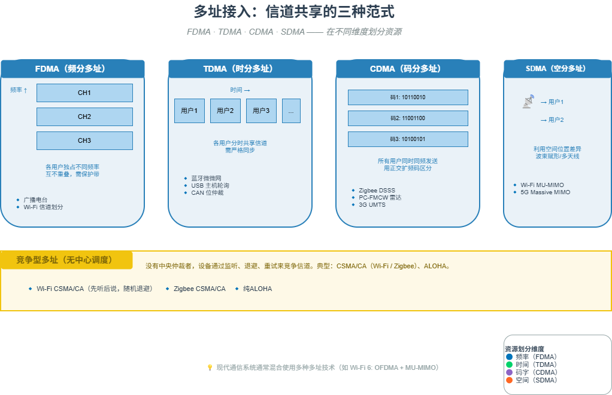

# M05 多址接入：信道共享的三种范式

> 多个设备如何共享同一信道？答案是在不同的物理维度上划分资源：频率、时间、码字、空间。

## 🧠 核心概念

多址接入技术的任务，是让多个用户共享有限的信道资源而不互相干扰（或可控地干扰）。从资源划分的维度，可以分为三大经典范式：

- **频分多址（FDMA）**：将总带宽划分为多个互不重叠的信道，每个用户独占一个信道。如收音机不同电台、Wi-Fi 信道划分。
- **时分多址（TDMA）**：将时间划分为周期性的帧，每帧再分成时隙，每个用户在自己的时隙发送。如蓝牙微微网、USB 主机轮询。
- **码分多址（CDMA）**：所有用户同时同频发送，用不同的正交扩频码区分。接收端用相关器解出自己信号，其他信号被“压”成噪声。如 Zigbee 的 DSSS、PC-FMCW 雷达。

此外还有 **空分多址（SDMA）**，利用多天线（MIMO）在空间维度区分用户，如 Wi-Fi 的 MU-MIMO。

现代通信系统通常混合使用多种多址技术，如 Wi-Fi 6 的 OFDMA（频分 + 时分） + MU-MIMO（空分）。

## 🖼️ 图示

*上图对比了 FDMA、TDMA、CDMA 的资源划分方式，并标注了典型技术案例。*

## ⚙️ 如何应用

### 场景1：频分多址（FDMA）
- **广播电台**：每个电台独占一个频率，接收者调谐到对应频率。
- **Wi-Fi 信道**：2.4 GHz 频段划分为 13 个 20 MHz 信道，不同 AP 可选择不同信道减少干扰。
- **光纤通信（WDM）**：不同波长（颜色）的光在同一光纤中传输。

### 场景2：时分多址（TDMA）
- **蓝牙微微网**：主设备为每个从设备分配特定时隙，所有设备在同一跳频信道上分时发送。
- **USB 主机轮询**：主机按微帧（USB 2.0 为 125 μs）为每个端点分配时间片，集中式 TDMA。
- **CAN 总线**：非破坏性位仲裁本质上是一种基于优先级的 TDMA——获胜节点获得当前时隙。
- **GSM（2G）**：每个频点被 8 个用户分时共享。

### 场景3：码分多址（CDMA）
- **Zigbee DSSS**：每 4 位数据映射为 32 位伪随机码片，不同网络用不同扩频码可共存。
- **PC-FMCW 雷达**：为每个雷达分配独特的相位编码序列，多个雷达可同时工作而不互扰。
- **3G（UMTS）**：所有用户同时同频，用 Walsh 码区分。

### 场景4：空分多址（SDMA）
- **Wi-Fi MIMO**：AP 利用多根天线同时与多个用户通信（MU-MIMO），空间流彼此隔离。
- **5G Massive MIMO**：基站通过波束赋形将能量聚焦到特定用户方向，实现空分复用。

### 场景5：竞争型多址（无中心调度）
- **Wi-Fi CSMA/CA**：先听后说，随机退避，分布式竞争。
- **Zigbee CSMA/CA**：类似但参数针对低功耗优化。
- **ALOHA**：最早的随机接入协议，想发就发，冲突后重试。

## 🔗 相关模型
- **M03 调制：比特→波形**：调制决定了信道的基本单元（子载波、时隙、码片）。
- **M16 演进即解耦**：OFDMA 是 Wi-Fi 从“独占信道”到“共享信道”的范式解耦。
- **M20 虚拟化：有限→无限**：多址接入正是用有限的物理资源创造多个逻辑信道。

## 💬 思考题
1. 为什么蓝牙微微网用 TDMA，而 Wi-Fi 用 CSMA/CA？两种设计分别优化了什么目标？
2. CDMA 中“所有用户同时同频发送”为什么不会互相淹没？扩频码的正交性是如何起作用的？
3. 如果你要设计一个低功耗传感器网络（数千节点，数据量极小，不频繁），你会选择哪种多址方式？为什么？

---
*创建日期：2026-04-18*  
*最后更新：2026-04-18*