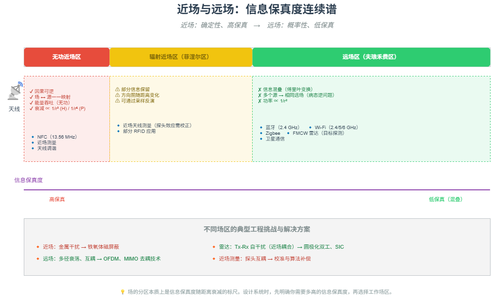

# M06 近场与远场：信息保真度连续谱

> 近场是确定性的高保真世界（因果可逆），远场是概率性的低保真混叠区（信息丢失）。

## 🧠 核心概念

电磁场从天线向外分为三个区域：

- **无功近场区**（\(R < \lambda/2\pi\)）：场与源强耦合，能量往复吞吐（无功功率），场分布唯一确定源分布。信息保真度极高，反向求解唯一。
- **辐射近场区（菲涅尔区）**（\(\lambda/2\pi < R < 2D^2/\lambda\)）：部分信息保留，方向图随距离变化，但仍可反演。
- **远场区（夫琅禾费区）**（\(R \ge 2D^2/\lambda\)）：远场方向图是源分布的傅里叶变换，高频细节丢失，多个不同的源可能产生几乎相同的远场方向图（病态逆问题）。信息保真度低。

这一连续谱决定了不同技术的设计哲学：**近场技术利用确定性（如 NFC），远场技术必须用冗余对抗不确定性（如 Wi-Fi、蓝牙）**。

## 🖼️ 图示

*上图展示了从近场到远场的信息保真度衰减过程，并标注了各区域内的典型技术和工程挑战。*

## ⚙️ 如何应用

### 场景1：近场确定性世界（NFC / RFID）
- **NFC 支付**：距离 < 10 cm，处于无功近场区。磁场强度随 \(1/r^3\) 衰减，能量和信息高度绑定。物理接近即信任基础，天然抗中继攻击（需极近距离）。
- **铁氧体屏蔽**：金属进入近场会改变边界条件（涡流反向磁场），用高磁导率铁氧体引导磁力线，恢复确定性耦合。
- **近场测量**：在辐射近场区扫描场分布，通过近远场变换（FFT）反推远场方向图。采样密度足够时，源重建唯一。

### 场景2：远场概率世界（蓝牙 / Wi-Fi）
- **蓝牙 TDD 噪声**：射频功放瞬变电流通过 PCB 传导耦合到音频电路（近场耦合问题），需加噪声滤波器。
- **Wi-Fi MIMO 互耦**：多天线间距远小于波长时，互耦（近场效应）导致方向图相关、信道容量下降。需去耦技术（中和线、缺陷地、EBG）强行恢复正交性。
- **Zigbee 共存**：与 Wi-Fi 同频段，通过 CCA、动态信道选择、PTA 仲裁等方式在概率性干扰中维持通信。

### 场景3：感知系统（FMCW 雷达）
- 目标处于远场区，雷达从混叠的回波中提取确定性参数（距离、速度、角度）。
- 发射-接收自干扰（近场耦合）需通过圆极化双工（隔离 > 30 dB）、自适应干扰抵消（SIC）处理。

### 场景4：信息保真度的工程权衡
- **近场**：高保真但工作距离极短 → 适合安全、身份认证、精密测量。
- **远场**：低保真但覆盖范围大 → 适合通信、广播、雷达探测。
- **设计启示**：系统的信息保真度需求决定了你应选择近场还是远场技术，或者两者结合（如蓝牙配对的 NFC 辅助）。

## 🔗 相关模型
- **M01 信息即不确定性的消除**：远场信息混叠正是“不确定性”的体现，需要冗余来恢复。
- **M02 冗余的双重面孔**：远场通信依赖信道冗余（FEC、ARQ）来对抗信息丢失。
- **M03 调制**：近场用简单调制（ASK、曼彻斯特），远场用复杂调制（OFDM、QAM）。

## 💬 思考题
1. 为什么 NFC 的功率随距离衰减速度（\(1/r^6\)）远快于 Wi-Fi（\(1/r^2\)）？这带来了什么安全优势？
2. 蓝牙耳机靠近人体时，天线性能会下降。这属于近场效应还是远场效应？为什么？
3. FMCW 雷达的 Tx-Rx 自干扰主要来自哪个场区？如何工程上解决？

---
*创建日期：2026-04-18*  
*最后更新：2026-04-18*