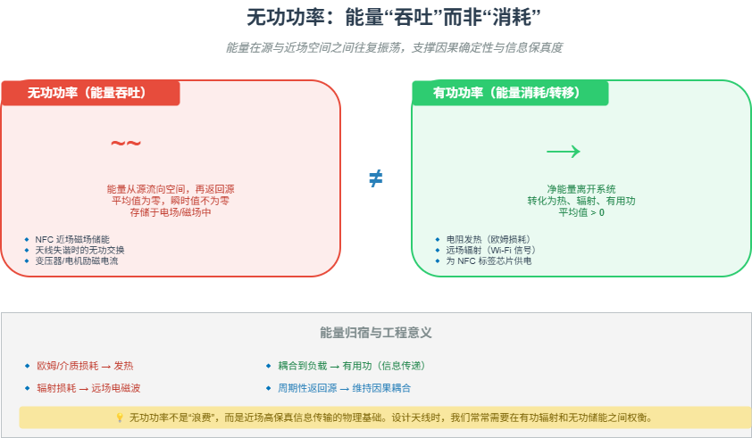

# M07 无功功率：能量“吞吐”而非“消耗”

> 无功功率不是能量消耗，而是能量在源与近场空间之间的往复“吞吐”，它支撑了因果确定性和信息保真度。

## 🧠 核心概念

在近场区（无功近场区），电磁场的能量并非单向辐射出去，而是在天线（源）和周围空间之间来回振荡。这种能量交换被称为**无功功率**，其平均值为零，但瞬时值不为零。

- **有功功率**：净离开系统的能量，最终转化为热、辐射或有用功（如为 NFC 芯片供电）。
- **无功功率**：能量在电场和磁场之间、在天线与空间之间吞吐，不产生净能量流失，但维持了源与场的因果耦合。

理解无功功率的关键：它不是“浪费”，而是近场高保真信息传输的物理基础。正是因为能量可以可逆地交换，场才能“记住”源的细节，实现高保真重建。

## 🖼️ 图示

*上图展示了近场区能量在源与空间之间的周期性吞吐，对比有功功率的净流出，并标注了相关技术案例。*

## ⚙️ 如何应用

### 场景1：NFC 的能量耦合
- NFC 读卡器发射 13.56 MHz 载波，能量存储在近场磁场中。
- 无源标签进入近场区后，从磁场中耦合能量，整流后为芯片供电，并利用负载调制回传信息。
- **关键**：能量吞吐是可逆的，标签的负载变化会反向影响读卡器的阻抗，形成双向通信的基础。

### 场景2：天线调谐与匹配
- 天线在自由空间调好后，装入设备（金属外壳、电池、屏幕）会改变近场边界条件。
- 这些物体通过互阻抗（Z₁₂）改变了天线的等效电感/电容，导致谐振频率漂移（S11 曲线变化）。
- 工程师通过添加匹配网络、铁氧体或调整天线形状来“补偿”这种无功变化，恢复原有的能量吞吐模式。

### 场景3：FMCW 雷达的 Tx-Rx 自干扰
- 发射天线的一部分能量通过近场直接耦合到接收天线（而不是经目标反射）。
- 这种自干扰属于无功/辐射近场耦合，会饱和接收机，降低灵敏度。
- 解决思路：圆极化双工（利用正交极化隔离）、自适应干扰抵消（产生反相信号抵消泄漏）。

### 场景4：电机与变压器中的无功功率
- 电机运行时，定子绕组和转子之间通过磁场交换无功功率，维持转矩。
- 无功功率不足会导致电压下降、电机过热；电力系统中通过电容器组进行无功补偿。

## 🔗 相关模型
- **M06 近场与远场**：无功功率是无功近场区的能量特征，区分于远场的有功辐射。
- **M01 信息即不确定性的消除**：无功功率支撑的因果可逆性，正是近场高信息保真度的物理来源。
- **M02 冗余的双重面孔**：无功功率不是“冗余”，而是系统必需的“结构性开销”。

## 💬 思考题
1. NFC 读卡器为何能同时为标签供电和通信？能量吞吐在其中扮演什么角色？
2. 为什么金属靠近天线会导致失谐？从无功功率的角度解释。
3. 如果天线的无功功率占比过高，对辐射效率有什么影响？在什么场景下我们反而希望无功功率大？

---
*创建日期：2026-04-18*  
*最后更新：2026-04-18*