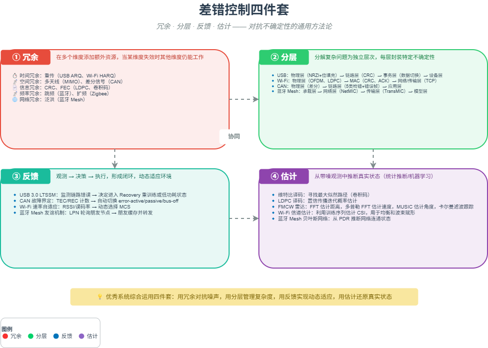

# M08 差错控制四件套

> 冗余、分层、反馈、估计 —— 用结构化方式对抗不确定性，在噪声中保真。

## 🧠 核心概念

所有通信与感知系统都必须面对同一个根本问题：如何在不确定的环境中保真？差错控制给出了四套通用思维模型：

1. **冗余**：在多个维度（时间、空间、信息、频率）添加额外资源，当某维度失效时其他维度仍能工作。如重传（时间）、多天线（空间）、CRC/FEC（信息）、跳频（频率）。
2. **分层**：将大问题分解为相对独立的层次，每层解决特定类型的噪声，层间通过标准化接口交互。如 OSI 模型、USB 协议栈。
3. **反馈**：形成“观测-决策-执行”闭环，动态调整系统行为以适应环境。如 ARQ、LTSSM 状态机、速率自适应。
4. **估计**：从带噪观测中推断真实状态，用概率统计方法还原信息。如维特比译码、卡尔曼滤波、信道估计。

这四个模型不是孤立的，而是相互嵌套、协同工作。优秀的系统会在不同层级、不同维度上综合运用它们。

## 🖼️ 图示

*上图展示了四个模型的相互关系及其在蓝牙、Wi-Fi、USB、CAN、FMCW 雷达中的典型应用。*

## ⚙️ 如何应用

### 场景1：冗余
- **时间冗余**：USB 批量传输的 ACK/NAK 重传；Wi-Fi 的 ARQ/HARQ。
- **空间冗余**：Wi-Fi MIMO（多天线分集）；CAN 差分信号。
- **信息冗余**：CRC（USB 三层 CRC、CAN 15位 CRC）；FEC（蓝牙 Coded PHY、Wi-Fi LDPC）。
- **频率冗余**：蓝牙自适应跳频（AFH）；Zigbee DSSS 扩频。
- **网络冗余**：蓝牙 Mesh 管理型泛洪（多路径转发）。

### 场景2：分层
- **USB 协议栈**：物理层（NRZI+位填充）→ 链路层（CRC、PID）→ 事务层（DATA0/DATA1 切换）→ 设备层（端点配置）。
- **Wi-Fi**：物理层（OFDM、LDPC）→ MAC 层（CRC、ACK）→ 网络层及以上（TCP 端到端确认）。
- **CAN**：物理层（差分信号）→ 链路层（5 类检错+错误帧）→ 应用层（端到端校验）。
- **蓝牙 Mesh**：承载层（广播/GATT）→ 网络层（NetMIC、TTL）→ 传输层（TransMIC、分段重组）→ 模型层。

### 场景3：反馈
- **USB 3.0 LTSSM**：链路训练状态机，根据错误计数、超时等动态调整链路状态（U0/U1/U2/U3/Recovery）。
- **CAN 故障界定**：每个节点维护 TEC/REC 计数器，根据错误历史自动切换 error-active / error-passive / bus-off。
- **Wi-Fi 速率自适应**：根据误码率、RSSI 动态选择 MCS（调制编码方案）。
- **蓝牙 Mesh 友谊机制**：低功耗节点定期轮询朋友节点，朋友缓存消息并转发。

### 场景4：估计
- **维特比译码**（卷积码）：在接收序列中寻找最大似然路径，恢复发送比特。
- **LDPC 译码**：通过置信传播迭代更新比特概率估计。
- **FMCW 雷达**：从差拍信号中估计目标距离（FFT）、速度（多普勒 FFT）、角度（MUSIC/ESPRIT），并用卡尔曼滤波跟踪。
- **信道估计**：Wi-Fi 利用长训练序列估计信道冲激响应，用于均衡。
- **蓝牙 Mesh 贝叶斯网络**：从端到端包送达率推断网络连通状态。

## 🔗 相关模型
- **M01 信息即不确定性的消除**：差错控制正是对抗不确定性、还原信息的方法论。
- **M02 冗余的双重面孔**：冗余是四件套之首，详细展开。
- **M04 同步**：同步是差错控制的前提。
- **M14 实时性**：反馈和估计在实时系统中的特殊要求。

## 💬 思考题
1. 蓝牙 Mesh 的“管理型泛洪”属于哪种冗余？它如何与分层和反馈结合？
2. 为什么 USB 3.0 的 LTSSM 是“反馈”模型而不是简单的状态机？它观测了什么？决策了什么？
3. FMCW 雷达的卡尔曼滤波属于“估计”模型。如果不用估计，只用阈值检测，会损失什么？

---
*创建日期：2026-04-18*  
*最后更新：2026-04-18*