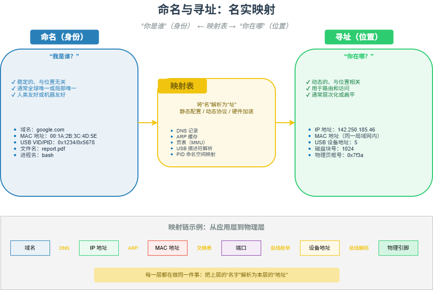

# M09 命名与寻址：名实映射

> “你是谁”（身份）和“你在哪”（位置）分离，通过映射表连接 —— 整个数字世界的底层建筑。

## 🧠 核心概念

任何需要被标识的实体（设备、进程、内存、数据包）都必须回答两个基本问题：

- **命名**：我是谁？—— 稳定的身份标识，通常与位置无关。
- **寻址**：我在哪？—— 动态的位置信息，用于路由和访问。

这两个概念通常被不同的机制处理，并通过**映射**关联起来。映射可以是静态表（如 DNS、ARP 缓存）、动态协议（如 DHCP、USB 枚举）或硬件加速（如 MMU）。

数字世界是一个多层嵌套的“名实映射”系统：应用层的域名 → IP 地址 → MAC 地址 → 总线地址 → 物理位置。每一层都在做同一件事：把上一层的“名字”解析为本层的“地址”。

## 🖼️ 图示

*上图展示了从应用层到物理层的多层映射链，以及不同技术中的命名/寻址实例。*

## ⚙️ 如何应用

### 场景1：网络协议栈的映射链
- **DNS**：域名（如 google.com）→ IP 地址（如 142.250.185.46）
- **ARP/NDP**：IP 地址 → MAC 地址（局域网内）
- **路由表**：IP 前缀 → 下一跳接口
- **交换表**：MAC 地址 → 端口号

### 场景2：总线与设备寻址
- **USB**：设备描述符中的 VID/PID（命名）→ 枚举时分配的设备地址（寻址，1-127）+ 端点号
- **PCIe**：Device ID/Vendor ID（命名）→ BDF 号（总线:设备:功能，寻址）
- **CAN 总线**：没有节点地址，用报文 ID 既标识消息类型（命名）又决定优先级（隐式寻址）
- **I²C / SPI**：静态设备地址（常通过硬件引脚配置）

### 场景3：计算机体系结构
- **虚拟内存**：虚拟地址（每个进程独立，命名）→ MMU + 页表 → 物理地址（寻址）
- **进程 ID（PID）**：用户通过进程名或作业 ID 引用进程（命名），内核通过 PID 索引 task_struct（寻址）
- **文件系统**：文件名（命名）→ inode → 磁盘块号（寻址）

### 场景4：操作系统与容器
- **PID 命名空间**：容器内 PID 1（局部命名）映射为主机上的某个高数值 PID（全局寻址），实现隔离与复用。
- **容器网络**：容器虚拟 IP（命名）通过 NAT 映射为主机端口或路由规则（寻址）。

### 场景5：命名与寻址的设计权衡
- **唯一性 vs 可复用性**：全球唯一标识（MAC、UUID）便于管理但数量有限；动态本地地址（DHCP、USB 设备地址）可复用但需要映射。
- **身份与位置合一 vs 分离**：CAN 报文 ID 合一（简单高效，但缺乏灵活性）；IP 地址分离（灵活但需 DNS/ARP 等映射）。
- **扁平 vs 层次**：扁平地址（MAC、PID）简单适合广播域；层次地址（IP、PCIe BDF）支持路由聚合。

## 🔗 相关模型
- **M05 多址接入**：多址技术需要为每个用户分配标识（地址）才能区分。
- **M15 分层**：每一层都在做命名→寻址的映射，分层边界正是映射的边界。
- **M20 虚拟化**：虚拟化技术本质上是创建新的命名空间，并映射到物理资源。

## 💬 思考题
1. 为什么 CAN 总线用报文 ID 既作为标识又作为优先级？这种合一的优缺点是什么？
2. 虚拟内存中，多个进程的相同虚拟地址如何映射到不同的物理地址？MMU 做了什么？
3. 如果让你设计一个全新的物联网协议，你会选择扁平地址还是层次地址？为什么？

---
*创建日期：2026-04-18*  
*最后更新：2026-04-18*