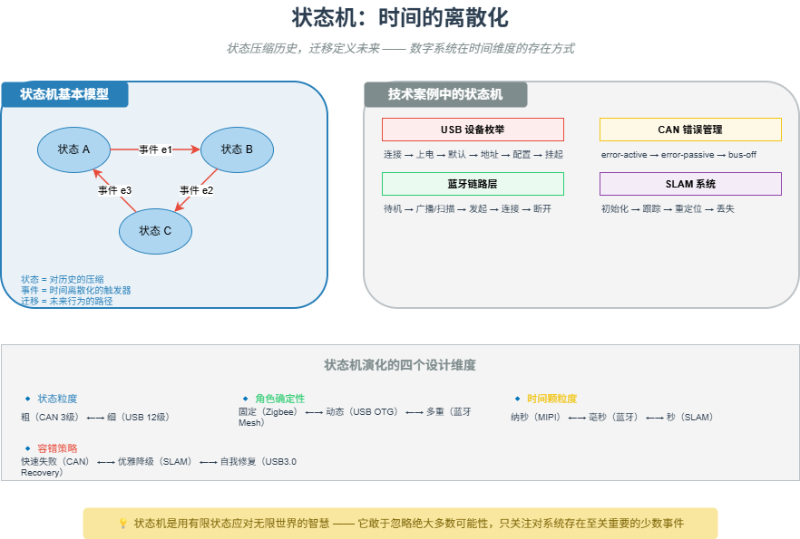

# M10 状态机：时间的离散化

> 状态压缩历史，迁移定义未来 —— 数字系统在时间维度的存在方式。

## 🧠 核心概念

物理世界是连续的（电压连续变化、射频场连续存在），而数字世界是离散的（只有 0 和 1、时钟边沿采样）。**状态机是跨越这道鸿沟的桥梁**。

状态机的三个核心要素：

- **状态**：系统在某一时刻所处的稳定局面。状态是对历史的压缩（如“已连接”意味着曾经完成握手）。
- **事件**：导致状态迁移的触发器（如“收到连接请求”、“超时”）。
- **动作**：在迁移过程中或进入新状态时执行的操作。

状态机让数字系统能够“记住”过去，并基于当前状态决定对未来的响应。没有状态机，系统就会像没有记忆的浮萍，每个瞬间都要重新理解世界。

## 🖼️ 图示

*上图展示了状态机的基本模型（状态、事件、迁移），以及蓝牙、USB、CAN、SLAM 中的典型状态机实例。*

## ⚙️ 如何应用

### 场景1：通信协议状态机
- **蓝牙链路层**：待机 → 广播/扫描 → 发起 → 连接 → 省电 → 断开。连接态内部还有嗅模、保持等子状态。
- **USB 设备枚举**：连接 → 上电 → 默认 → 地址 → 配置 → 挂起。每个状态对应不同的响应行为（如地址态只响应指定地址的请求）。
- **CAN 错误管理**：error-active → error-passive → bus-off。由 TEC/REC 计数器自动触发状态迁移，硬件实现。
- **NFC 激活**：空闲 → 发现 → 选择 → 激活 → 休眠。极短超时（<1ms）要求状态机硬件化。

### 场景2：操作系统进程状态
- 创建 → 就绪 → 运行 → 阻塞/停止 → 终止（僵尸）→ 死亡。调度器通过状态迁移管理 CPU 时间片分配。
- 僵尸进程：已终止但 PCB 仍保留，等待父进程回收。

### 场景3：机器人 SLAM
- **前端跟踪**：连续处理每帧图像，属于实时状态。
- **后端优化**：仅在关键帧插入时触发，属于事件驱动状态。
- **重定位**：当跟踪丢失时进入，尝试恢复位姿，相当于状态机的“异常处理”状态。

### 场景4：状态机设计维度
- **状态粒度**：粗粒度（CAN 仅 3 级错误状态）vs 细粒度（USB 3.0 LTSSM 有 12 个高级状态）。
- **角色确定性**：固定角色（Zigbee 协调器/路由器/终端）vs 动态角色（USB OTG 可翻转主从）vs 多重角色（蓝牙 Mesh 节点可同时是中继、朋友、低功耗）。
- **时间颗粒度**：纳秒级（MIPI 物理层状态机）vs 毫秒级（蓝牙连接事件）vs 秒级（SLAM 后端优化）。

## 🔗 相关模型
- **M06 近场与远场**：近场确定性需要硬件状态机来保证时序。
- **M08 差错控制**：CAN 错误状态机是反馈模型的具体实现。
- **M15 分层**：协议栈的每一层都有自己的状态机，通过接口交互。

## 💬 思考题
1. 为什么 CAN 总线的错误状态机（error-active/passive/bus-off）必须用硬件实现？软件模拟会有什么问题？
2. 在 SLAM 中，为什么“重定位”状态需要单独设计？它与“初始化”状态有何不同？
3. 举一个你熟悉的系统（如电梯、自动售货机）的状态机例子，画出它的状态迁移图。

---
*创建日期：2026-04-18*  
*最后更新：2026-04-18*