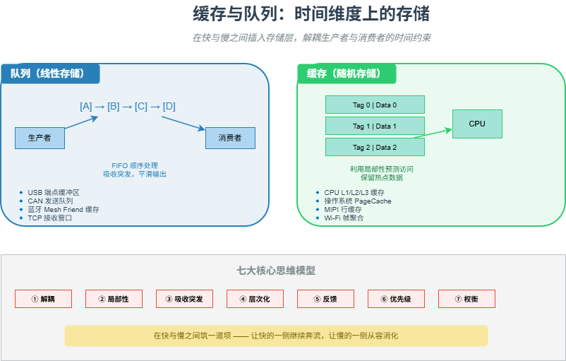

# M11 缓存与队列：时间维度上的存储

> 在快与慢之间插入存储层，解耦生产者与消费者的时间约束。

## 🧠 核心概念

所有速度不匹配问题，归根结底是时间尺度上的错配。CPU 纳秒级运行，磁盘毫秒级响应；网络微秒级涌入，应用毫秒级消化。直接耦合会导致快的被慢的拖累。

**缓存与队列的共同本质：在时间轴上插入存储层**，将紧耦合的时间依赖转化为松耦合的异步协作。

- **队列**：时间上的线性存储，解决“顺序错配”——生产者瞬间产生多个数据，消费者逐一处理。
- **缓存**：时间上的随机存储，解决“重复错配”——同一数据被反复访问，慢速存储无法快速响应。

## 🖼️ 图示

*上图展示了队列（线性存储）与缓存（随机存储）的核心区别，以及它们在不同技术中的典型应用。*

## ⚙️ 如何应用

### 场景1：队列（生产者-消费者解耦）
- **蓝牙 Mesh Friend 节点**：为低功耗节点缓存消息，LPN 可深度睡眠，Friend 代为接收。
- **USB 端点缓冲区**：主机可连续发送，设备按自身速度读取，解耦了总线速率与设备处理速率。
- **CAN 发送队列**：应用层产生报文后放入队列，驱动层在总线空闲时发送，应用不被阻塞。
- **NFC Outbox 模式**：扫描记录先存入持久化队列，立即返回用户反馈，网络同步异步进行。
- **操作系统消息队列**：中断服务程序将数据放入队列，内核线程后续处理，缩短关中断时间。

### 场景2：缓存（局部性与预测）
- **CPU 多级缓存（L1/L2/L3）**：利用时间局部性（循环变量）和空间局部性（数组遍历），用快速存储覆盖热点数据。
- **操作系统 PageCache**：缓存最近读写的文件页，预测应用程序会再次访问。
- **Wi-Fi 帧聚合**：驱动程序收集发往同一目的地的多个帧，攒到一定数量再发送，预测很快会有更多数据。
- **MIPI 行缓存**：摄像头采集一行像素后暂存，供图像处理算法（滤波、缩放）使用。

### 场景3：吸收突发与流量整形
- **Wi-Fi CSMA/CA 退避队列**：多节点同时发送时，随机退避将突发请求平滑摊开，降低碰撞概率。
- **USB 双缓冲**：一个缓冲区处理当前数据，另一个接收下一数据，实现流水线。
- **TCP 接收窗口**：暂存乱序到达的包，同时通过窗口通告控制发送方速率（背压）。

### 场景4：层次化缓冲（不同时间尺度）
- **文件写入路径**：用户 C 库缓冲区（微秒级）→ 内核 PageCache（毫秒级）→ 磁盘写缓存（秒级）。
- **MIPI 摄像头系统**：物理层异步 FIFO（纳秒级）→ 控制器层行缓冲（微秒级）→ 应用层帧缓存（毫秒级）。

### 场景5：队列中的优先级与公平性
- **CAN 总线**：ID 越小优先级越高，硬件级优先级队列，确保关键报文实时性。
- **Wi-Fi EDCA**：语音、视频、尽力而为、背景四个队列，不同 AIFS/CW 参数实现软优先级。
- **USB EHCI 调度器**：周期传输（同步/中断）优先，非周期传输（批量/控制）在剩余带宽中轮询。

## 🔗 相关模型
- **M12 中断 vs 轮询**：队列可以缓冲中断产生的数据，降低中断频率。
- **M13 DMA 与零拷贝**：DMA 是硬件级的数据搬运队列/缓存。
- **M21 占空比游戏**：队列/缓存允许设备深度睡眠，降低占空比。

## 💬 思考题
1. 为什么 CPU 缓存用 SRAM 而不用 DRAM？容量与速度的权衡如何体现？
2. 蓝牙 Mesh 的 Friend 节点缓存属于队列还是缓存？它解决了什么问题？
3. 如果你的系统出现“接收端处理不过来导致丢包”，你会优先增加队列深度还是优化消费者处理速度？为什么？

---
*创建日期：2026-04-18*  
*最后更新：2026-04-18*