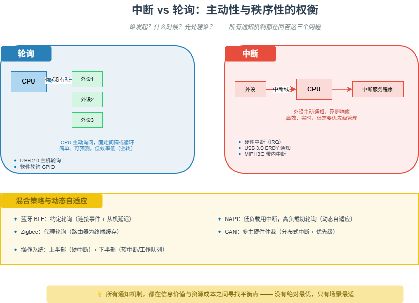

# M12 中断 vs 轮询：主动性与秩序性的权衡

> 谁发起？什么时候？先处理谁？—— 所有通知机制都在回答这三个问题。

## 🧠 核心概念

CPU 只有一个，但要处理的外设却有很多。外设怎么让 CPU 知道“我有事”？只有两种基本策略：

- **轮询**：CPU 主动定期检查每个外设的状态寄存器 —— “你有事吗？你有事吗？”
- **中断**：外设通过专用信号线主动通知 CPU —— “喂，我有事！”

没有一种策略是完美的。所有通知机制的设计，都必须在三个维度上做出权衡：

1. **主动性**：谁发起通信？（CPU 主动 vs 设备主动）
2. **时间性**：什么时候通信？（固定时刻 vs 异步随机）
3. **秩序性**：多个同时发生时先处理谁？（严格优先级 vs 公平竞争）

## 🖼️ 图示

*上图对比了中断与轮询的主动性和时间性，展示了硬件中断、USB 轮询、蓝牙约定轮询、NAPI 动态切换等典型应用。*

## ⚙️ 如何应用

### 场景1：硬件中断（计算机体系结构）
- **中断控制器**：为每个中断源分配优先级，多个中断同时到达时选最高优先级的通知 CPU。
- **中断向量表**：每个中断源对应一个内存地址，CPU 被中断后硬件自动跳转，响应极快。
- **中断嵌套**：高优先级中断可打断低优先级中断处理，确保紧急事件优先。

### 场景2：轮询的极致（USB 2.0）
- USB 2.0 所有通信必须由主机发起，设备只能被动应答。
- 原因：有线、独占总线，主机“问一圈”成本低；简化设备设计；适合 PC 外设。
- 即使“中断传输”，本质也是主机以固定周期（如 1ms）轮询端点。

### 场景3：约定轮询（蓝牙 BLE）
- 建立连接时双方约定“连接事件”的时间点，主机在每个连接事件主动发送数据包。
- 从机只有在收到包后才能回复，但可在回复时“顺便”上报数据，实现主动上报的效果。
- **从机延迟（Slave Latency）**：允许从机在无数据时跳过多个连接事件，继续休眠。
- 这是轮询和中断的巧妙折中 —— 用“约定”来预测“有事”的时刻。

### 场景4：代理轮询（Zigbee）
- 网络分为路由器（市电供电，常开）和终端设备（电池供电，深度休眠）。
- 路由器为终端设备缓存数据，终端定期醒来向路由器“取件”。
- 相当于把轮询任务外包给路由器，终端只需在约定时间醒来快速取走数据。

### 场景5：动态平衡（NAPI）
- Linux 网卡驱动中的 NAPI（New API）：低负载时用中断（响应快），高负载时自动关闭中断，切换到轮询模式批量收包。
- 本质：中断与轮询在时间维度上的融合，动态自适应。

### 场景6：多主硬件仲裁（CAN）
- 任何节点都可主动发送，多个节点同时发送时通过 ID 字段逐位仲裁。
- ID 最小的节点（优先级最高）自动获胜，继续发送。
- 从节点的视角看，收到一个比自己 ID 更小的帧，就是被“打断”了。
- 这是中断思想在链路层的极致 —— 优先级裁决由硬件完成，无需主机干预。

### 场景7：带内中断（MIPI I3C）
- 解决 I2C 每个设备都需要独立中断引脚的问题。
- 从设备直接在总线上发起中断请求，可携带 1 字节中断原因数据（MDB），减少主机查询。
- 用协议复杂度换引脚数，是移动设备小型化的必然选择。

## 🔗 相关模型
- **M11 缓存与队列**：队列可以缓冲中断产生的数据，降低中断频率（中断合并）。
- **M13 DMA 与零拷贝**：DMA 传输完成后发中断，实现数据搬运与 CPU 计算并行。
- **M21 占空比游戏**：中断 vs 轮询直接决定系统唤醒频率，影响平均功耗。

## 💬 思考题
1. 为什么 USB 2.0 用轮询，而 USB 3.0 引入了设备主动通知（ERDY）？什么条件发生了变化？
2. 蓝牙的“约定轮询”与 Zigbee 的“代理轮询”有什么本质区别？分别优化了什么？
3. 如果你的系统出现“中断风暴”（中断频率过高导致 CPU 被占满），你会用 NAPI 还是其他方法解决？

---
*创建日期：2026-04-19*  
*最后更新：2026-04-19*