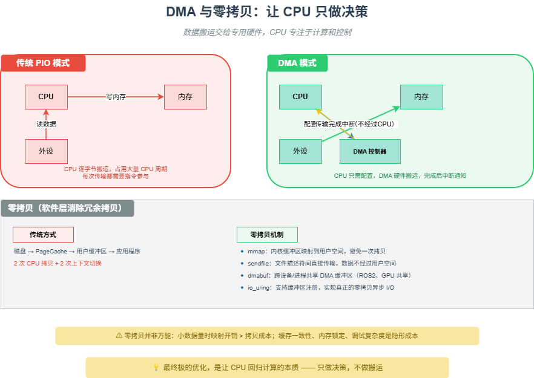

# M13 DMA 与零拷贝：让 CPU 只做决策

> 数据搬运交给专用硬件，CPU 专注于计算和控制 —— 专业分工，各司其职。

## 🧠 核心概念

在冯·诺依曼架构中，CPU 既是计算的核心，也是数据流动的指挥者。然而，当数据量爆炸式增长，CPU 如果还要亲自搬运每一个字节，就会陷入“搬运”与“计算”的资源竞争。

- **DMA（Direct Memory Access）**：硬件控制器直接在外设和内存之间传输数据，传输完成后才中断 CPU。CPU 只需配置源地址、目的地址、长度，然后就可以去做其他事情。
- **零拷贝（Zero-Copy）**：在软件层面消除不必要的数据复制，通过传递引用（指针、文件描述符）而非复制数据内容，减少 CPU 参与的拷贝次数。

DMA 解决的是“外设 ↔ 内存”的第一次搬运；零拷贝解决的是“内核 ↔ 用户态”以及“模块 ↔ 模块”之间的冗余拷贝。两者结合，构成一条从物理设备到应用程序的端到端数据高速公路。

## 🖼️ 图示

*上图对比了传统 PIO 模式与 DMA 模式的区别，并展示了零拷贝的 mmap、sendfile、dmabuf 等典型技术。*

## ⚙️ 如何应用

### 场景1：DMA 硬件数据搬运
- **USB 控制器**：内置 DMA 引擎，使用描述符环管理传输任务。USB 3.0 支持 Scatter-Gather，可处理非连续物理内存。
- **MIPI CSI-2 接收器**：DMA 将图像数据直接写入物理连续的内存（通过 CMA 分配），CPU 无需干预。
- **NVMe SSD**：通过 PCIe 总线直接与内存交换数据，提交队列和完成队列完全由硬件 DMA 管理。
- **以太网卡**：将收到的网络帧 DMA 到预分配的环形缓冲区，驱动只需处理描述符。

### 场景2：操作系统零拷贝机制
- **mmap**：将内核缓冲区映射到用户空间，应用程序直接访问 DMA 写入的数据，避免 read() 拷贝。
- **sendfile**：在两个文件描述符之间直接传输数据，数据全程不经过用户空间（如 Web 服务器发送文件）。
- **splice**：基于管道的零拷贝，可在内核空间移动数据。
- **io_uring**：支持缓冲区注册和共享，配合 DMA 实现真正的零拷贝 I/O。

### 场景3：跨设备/跨模块零拷贝
- **dmabuf**（Linux）：不同设备驱动共享同一个 DMA 缓冲区，传递文件描述符而非复制数据。
- **ROS2 中的 dmabuf_transport**：相机节点导出 dmabuf_fd，SLAM 节点和可视化节点共享同一图像缓冲区，消除节点间的大数据拷贝。
- **GPU 与显示器共享**：渲染结果直接通过 dmabuf 传递给显示控制器，无需回读内存。

### 场景4：零拷贝的隐形成本与权衡
- **缓存一致性**：DMA 写内存后，CPU 缓存可能包含旧数据，需要 cache flush/invalidate。
- **内存锁定（Pinning）**：用于 DMA 的页面不能换出，可能减少可用内存。
- **适用边界**：小数据量（几十字节）时，建立共享映射的开销可能超过拷贝本身；数据需要修改时，零拷贝反而增加复杂度。

## 🔗 相关模型
- **M11 缓存与队列**：DMA 本质上是一个硬件级的“数据搬运队列”。
- **M12 中断 vs 轮询**：DMA 传输完成后通过中断通知 CPU，实现异步并行。
- **M21 占空比游戏**：DMA 让 CPU 能深度睡眠，大幅降低占空比。

## 💬 思考题
1. 为什么 USB 2.0 的批量传输仍然需要 CPU 参与描述符环管理，而不是完全由 DMA 自动完成？
2. 在什么情况下零拷贝反而会降低性能？请举例说明。
3. 如果你设计一个高速数据采集系统（100 MSPS ADC），你会如何利用 DMA 和零拷贝来最小化 CPU 负载？

---
*创建日期：2026-04-19*  
*最后更新：2026-04-19*