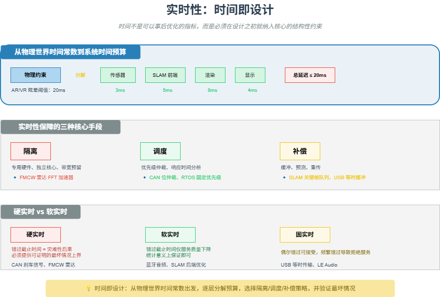

# M14 实时性：时间即设计

> 时间不是可以事后优化的性能指标，而是必须在设计之初就纳入核心的结构性约束。

## 🧠 核心概念

实时性不是在“快”，而是在“确定性”。硬实时系统要求绝对的时间承诺（刹车信号迟到即失效），软实时系统允许偶尔超时（视频卡顿可容忍）。所有保障实时性的技术，归根结底是三种手段的组合：

- **隔离**：消除干扰源，为关键任务保留专用资源（专用硬件、独立核心、带宽预留）
- **调度**：管理竞争顺序，保证高优先级任务优先执行（优先级仲裁、响应时间分析）
- **补偿**：吸收波动，用缓冲、预测、重传等机制平滑时间不确定性

**时间即设计**意味着：在写下第一行代码之前，就必须理解物理世界的时间常数，将顶层时间需求逐层分解到子系统、模块、甚至硬件单元，并留有余量。

## 🖼️ 图示

*上图展示了从物理世界时间常数到系统时间预算的分解过程，以及隔离、调度、补偿三种保障手段。*

## ⚙️ 如何应用

### 场景1：硬实时（错过即灾难）
- **CAN 总线**：报文 ID 优先级仲裁，保证刹车信号在微秒级内送达。总线负载通常控制在 30% 以下，为紧急消息留出空闲时间。
- **FMCW 雷达**：Chirp 周期由最大探测距离决定，ADC 采样、FFT 计算必须在下一个 Chirp 开始前完成。专用硬件加速器保证时间确定性。
- **NFC 卡模拟**：读写器等待时间窗口（FWT）通常为 4.8ms，卡片必须在此窗口内响应。通过 WTX 扩展可延长，但会增加交易时间。

### 场景2：固实时（偶尔错过可接受）
- **USB 等时传输**：主机为同步端点预留带宽（如 90% 微帧），不进行握手重传。偶尔丢包只是画面噪点，但连续丢失会导致流中断。
- **LE Audio**：同步通道（CIS）定义 ISO 间隔，最小可短至 400µs，保证多声道音频同步。

### 场景3：软实时（错过仅降级）
- **蓝牙经典音频**：A2DP 连接偶尔卡顿可容忍，通过缓冲平滑抖动。
- **视觉 SLAM 后端**：闭环检测延迟几秒钟不影响前端跟踪，但长时间阻塞会导致位姿漂移。

### 场景4：时间即设计的实践
- **AR/VR 运动到光子延迟**：上限 20ms。分解为：传感器采样 3ms → SLAM 前端 5ms → 渲染 8ms → 显示传输 4ms。每一层必须分配明确的时间预算。
- **汽车制动**：100km/h 下，10ms 延迟增加制动距离 28cm。因此制动信号端到端延迟必须 <10ms，且需通过响应时间分析（RTA）证明。
- **MCU 选型**：硬实时任务需要关注最坏情况中断延迟、Flash 等待状态、TCM 紧耦合内存等时间指标，而非只看主频。

### 场景5：实时系统的设计检查
- 列出所有硬实时任务，测量最坏情况执行时间（WCET）。
- 识别共享资源：能否改成无锁（环形缓冲区、双缓冲）？否则必须用优先级继承协议。
- 验证最坏情况响应时间（RTA 公式），并添加安全余量（如 CPU 负载 <70%）。

## 🔗 相关模型
- **M12 中断 vs 轮询**：中断延迟是实时性的关键指标。
- **M08 差错控制**：超时重传是时间冗余的一种补偿手段。
- **M22 实时系统的三种隔离**：详细展开时间、资源、优先级隔离。

## 💬 思考题
1. 为什么硬实时系统不能用“平均延迟”来评估，而必须用“最坏情况延迟”？
2. FMCW 雷达的 FFT 计算如果超时，会导致什么后果？为什么不能用软件中断来调度？
3. 在设计一个无人机飞控系统时，你会如何分解 1ms 的控制周期预算？

---
*创建日期：2026-04-19*  
*最后更新：2026-04-19*