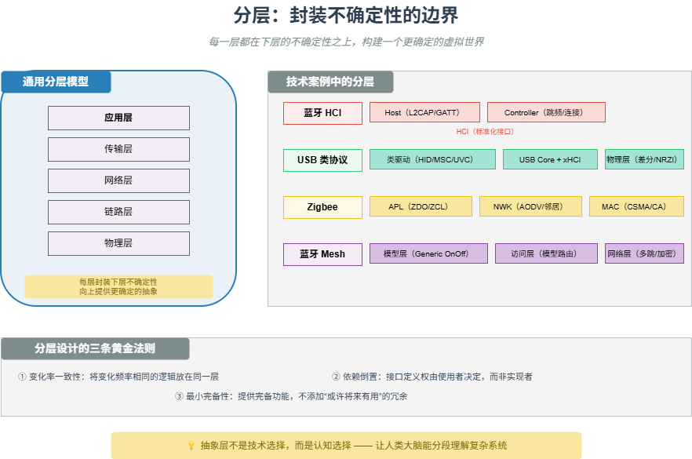

# M15 分层：封装不确定性的边界

> 每一层都在下层的不确定性之上，构建一个更确定的虚拟世界。

## 🧠 核心概念

任何通信系统都面临一个根本矛盾：物理世界是连续的、模拟的、不可预测的，而我们需要的是离散的、数字的、确定的结果。分层的本质，就是建立一道又一道的抽象边界，将下层的复杂性封装在内部，向上层呈现更简单的契约。

- **物理层**封装电压波动、信号衰减、噪声干扰，向上提供比特流。
- **链路层**封装比特错误、介质竞争，向上提供无错帧。
- **网络层**封装路由选择、拓扑变化，向上提供端到端传输。

分层的核心价值在于：**变化隔离**（一层改动不影响其他层）、**分工协作**（不同团队可独立开发）、**认知降维**（开发者只需理解所在层的抽象）。

## 🖼️ 图示

*上图展示了通用分层模型，以及蓝牙 HCI、USB 类协议、Zigbee MAC/NWK、蓝牙 Mesh 模型层的具体实例。*

## ⚙️ 如何应用

### 场景1：蓝牙 HCI（主机控制器接口）
- **下层（Controller）**：处理跳频（1600跳/秒）、连接事件调度、加密、链路层状态机。时间关键，必须硬件/固件实现。
- **上层（Host）**：处理 L2CAP 协议复用、ATT/GATT 应用框架、SDP 服务发现。策略灵活，适合软件实现。
- **接口（HCI）**：标准化命令/事件/数据包，通过 UART/USB/SDIO 传输。产业链分工：芯片厂商做 Controller，操作系统厂商做 Host。

### 场景2：USB 类协议
- **物理层**：差分信号、NRZI 编码、位填充。
- **链路层**：包结构、CRC、PID 校验。
- **事务层**：令牌-数据-握手三阶段，数据切换位（DATA0/DATA1）。
- **设备层**：描述符解析、端点管理。
- **类协议**：HID、MSC、UVC、CDC 等，实现即插即用。

### 场景3：Zigbee MAC 与 NWK 分离
- **MAC 层（IEEE 802.15.4）**：CSMA/CA 退避、ACK 超时重传、CCA 空闲信道评估、信标管理。
- **NWK 层**：AODV 路由发现、邻居表、地址分配（树形/网状）。
- **上层**：APS 数据服务、ZDO 设备管理、ZCL 应用集群。
- 芯片厂商提供 PHY/MAC，协议栈厂商提供 NWK/APL，终端开发者只调用“开关灯”API。

### 场景4：蓝牙 Mesh 模型层
- **承载层**：广播承载（ADV）或 GATT 承载，隐藏物理传输方式。
- **网络层**：多跳中继、消息缓存去重、TTL 控制、双层加密（NetKey/AppKey）。
- **传输层**：分段与重组（SAR）、确认消息（ACK）。
- **访问层**：模型（Model）路由，将消息分发给对应的模型实例。
- **模型层**：定义状态和消息（如 Generic OnOff Server），实现跨厂商互操作。

### 场景5：分层设计的关键原则
- **变化率一致性**：将变化频率相同的逻辑放在同一层，用稳定接口隔离变化频率不同的部分。
- **依赖倒置**：接口定义权由使用者决定，而非实现者。
- **最小完备性**：接口应提供完备功能，但不添加“或许将来有用”的冗余。
- **抽象泄漏**：如果下层细节被迫暴露给上层，抽象就“泄漏”了，应重新设计边界。

## 🔗 相关模型
- **M11 缓存与队列**：队列是层间解耦的典型手段（生产者-消费者）。
- **M16 演进即解耦**：分层是解耦的一种结构形式。
- **M26 抽象层的经济学**：每层抽象都是一笔“用层内复杂度换取层外简单度”的交易。

## 💬 思考题
1. 蓝牙 HCI 接口为什么能保持十余年不变？它隔离了什么变化？
2. USB 设备类协议如果过粗（只有一个“通用设备类”）会怎样？过细（每种设备单独一类）会怎样？
3. 在你熟悉的系统中，是否出现过“抽象泄漏”的情况？如何修复？

---
*创建日期：2026-04-19*  
*最后更新：2026-04-19*