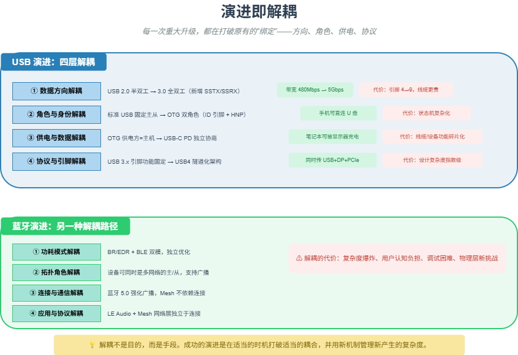

# M16 演进即解耦

> 每一次重大升级，都在打破原有的“绑定”——方向、角色、供电、协议，释放新的可能性。

## 🧠 核心概念

系统的演进不是简单的功能叠加，而是通过**解耦**将原本绑定的要素拆分开，让它们可以独立变化。解耦释放了新的能力，但也引入了新的复杂度。

观察 USB、蓝牙等技术的演进史，可以提炼出几个典型的解耦层次：

1. **数据方向解耦**：半双工 → 全双工（USB 2.0 → 3.0）
2. **角色与身份解耦**：固定主从 → 可协商角色（USB OTG、蓝牙主从切换）
3. **供电与控制解耦**：供电方必须为主机 → 独立协商（USB-C PD）
4. **功能与引脚解耦**：引脚功能固定 → 隧道化/可重配置（USB4、软件定义无线电）

每一次解耦都让系统更灵活，但也带来复杂度增加、调试困难、用户认知负担上升等代价。成功的演进是在适当的时机打破适当的耦合，并用新机制管理新产生的复杂度。

## 🖼️ 图示

*上图展示了 USB 和蓝牙演进中的四层解耦路径，以及每层解耦带来的能力与代价。*

## ⚙️ 如何应用

### 场景1：USB 的演进 —— 解耦的教科书
- **USB 2.0 → 3.0**：数据方向解耦。增加 SSTX/SSRX 专用差分对，半双工变全双工，带宽从 480Mbps 跃升至 5Gbps。代价：引脚从 4 根增至 9 根，线缆更贵。
- **USB OTG**：角色与身份解耦。引入 ID 引脚和 HNP 协议，手机可临时成为主机读取 U 盘。代价：状态机复杂，兼容性问题增多。
- **USB-C + PD**：供电与数据解耦。CC 引脚和 PD 协议独立协商供电方向和数据角色，笔记本可被显示器充电同时作为数据外设。代价：线缆/设备功能碎片化。
- **USB4**：协议与引脚解耦。隧道化架构将 USB、DisplayPort、PCIe 封装成数据包混合传输。代价：设计复杂度指数级上升，调试困难。

### 场景2：蓝牙的演进 —— 另一种解耦路径
- **BR/EDR → BLE**：功耗模式解耦。同一射频，两套协议栈独立运行，物联网设备可用纽扣电池运行数年。代价：双模芯片面积增加，协议栈复杂度翻倍。
- **蓝牙 4.1/4.2**：拓扑角色解耦。设备可同时是多个微微网的主或从，信标广播实现一对多。代价：连接管理更复杂。
- **蓝牙 5.0**：连接与通信解耦。强化广播能力，广播包从 31 字节扩至 255 字节，Mesh 网络成为可能。代价：广播信道拥塞风险。
- **LE Audio + Mesh**：应用与协议解耦。LC3 编码统一音频，Mesh 网络层独立于点对点连接。代价：生态迁移需要时间。

### 场景3：解耦的代价与权衡
- **复杂度爆炸**：USB 2.0 状态机简单（主机/外设），USB-C PD 需处理供电协商、角色协商、替代模式，兼容性问题剧增。
- **用户认知负担**：用户不需要理解“半双工 vs 全双工”，但需要知道“为什么这根 C 线能充电不能传数据”。
- **调试困难**：USB 2.0 时代不识别大概率是驱动或供电；USB-C 时代可能是线缆不支持、PD 协商失败、角色冲突等。

### 场景4：设计新系统时的解耦判断
- 当前有哪些要素是绑定的？数据方向、角色身份、供电控制、功能引脚？
- 哪个绑定最阻碍系统演进？优先解耦那个。
- 解耦后如何管理新复杂度？（增加协议、增加引脚、增加智能）
- 解耦的收益是否大于代价？（带宽翻倍 vs 线缆成本翻倍）

## 🔗 相关模型
- **M15 分层**：分层是解耦的一种结构形式，接口是解耦的边界。
- **M17 专用化 vs 通用化**：解耦通常是为了走向更通用，但也可能走向专用。
- **M26 抽象层的经济学**：解耦是在不同抽象层之间重新分配复杂度。

## 💬 思考题
1. USB 3.0 增加 SSTX/SSRX 通道实现全双工，属于哪种解耦？为什么不能通过改进编码在原有 D+/D- 上实现全双工？
2. 蓝牙 5.0 强化广播能力后，对传统面向连接的 BR/EDR 有什么影响？这是取代还是共存？
3. 如果你要设计一个下一代无线技术，你会优先解耦哪个现有技术中的“绑定”？

---
*创建日期：2026-04-19*  
*最后更新：2026-04-19*