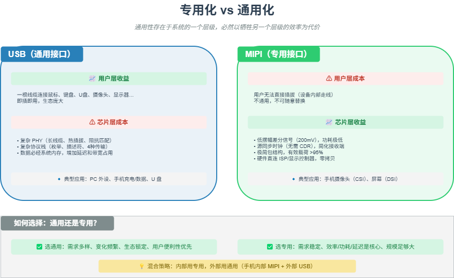

# M17 专用化 vs 通用化

> 通用性存在于系统的一个层级，必然以牺牲另一个层级的效率为代价。

## 🧠 核心概念

在系统设计中，**通用**和**专用**是一对永恒的矛盾。通用接口（如 USB）可以连接无数种设备，但协议复杂、功耗高、延迟大；专用接口（如 MIPI）只服务特定场景，但效率极致、功耗低、延迟小。

关键洞察：**通用性和专用性不是技术本身的属性，而是系统层级的属性**。一个接口在用户层是通用的（一根 Type-C 线充所有设备），在芯片层就必须付出复杂度的代价。反之，一个在芯片层专用的接口（MIPI D-PHY）在用户层不可见，但换来了极致的能效。

因此，设计决策的本质是：**在哪个层级承担复杂度，在哪个层级获得便利**。

## 🖼️ 图示

*上图对比了通用接口（USB）与专用接口（MIPI）在不同层级的成本-收益分配，以及各自的适用场景。*

## ⚙️ 如何应用

### 场景1：USB（通用接口）
- **用户层收益**：一根线缆连接鼠标、键盘、U盘、摄像头、显示器……即插即用，生态庞大。
- **芯片层成本**：复杂的 PHY（需支持长线缆、热插拔、阻抗匹配）、复杂的协议栈（枚举、描述符、四种传输类型）、软件开销大。
- **系统层成本**：数据必经系统内存（两次 DMA 拷贝），增加延迟和内存带宽占用。

### 场景2：MIPI（专用接口）
- **用户层成本**：用户无法直接插拔（设备内部走线），不通用。
- **芯片层收益**：低摆幅差分信号（200mV）、源同步时钟（无需 CDR）、极简包结构（有效载荷 >95%），功耗极低。
- **系统层收益**：硬件直连 ISP/显示控制器，零拷贝，零内存带宽占用。

### 场景3：CPU vs GPU/DSP/NPU
- **CPU（通用）**：可运行任意程序，但处理大规模并行任务效率低。
- **GPU/DSP/NPU（专用）**：只做特定计算（图形/信号/AI），但效率高几个数量级（功耗、吞吐量）。

### 场景4：何时选择专用化？
- **需求稳定、变化极小**：如移动设备内部的摄像头和屏幕连接，十年来接口规范几乎不变。
- **效率/功耗/延迟是核心指标**：如 AR/VR 需要极低延迟，必须用专用接口。
- **规模足够大**：专用化的研发成本可以被海量出货摊薄（如手机摄像头每年数十亿颗）。

### 场景5：何时选择通用化？
- **需求多样、变化频繁**：如 PC 外设市场，每年都有新设备类型。
- **生态锁定效应**：通用接口一旦成为事实标准，替代成本极高（如 USB 在 PC 外设的地位）。
- **用户便利性优先**：如消费电子产品，用户希望“一根线解决所有问题”。

### 场景6：混合策略
- **手机内部**：MIPI（专用）连接摄像头和屏幕，USB（通用）连接外部设备。
- **笔记本电脑**：内部 PCIe（专用）连接 SSD/GPU，外部 USB/Thunderbolt（通用）连接外设。
- **物联网网关**：内部 SPI/I2C（专用）连接传感器，外部 Wi-Fi/Ethernet（通用）连接云端。

## 🔗 相关模型
- **M15 分层**：通用和专用是不同层级上的不同选择。
- **M16 演进即解耦**：通用接口往往通过解耦来增加灵活性。
- **M26 抽象层的经济学**：通用性是用层内复杂度换取层外简单度。

## 💬 思考题
1. 为什么手机内部不用 USB 连接摄像头和屏幕？如果用 USB，会牺牲什么？
2. GPU 是专用处理器，但为什么现在的 GPU 也能做通用计算（GPGPU）？这属于“专用走向通用”还是“通用走向专用”？
3. 如果你设计一款智能手表，你会如何选择内部总线（专用）和外部接口（通用）？为什么？

---
*创建日期：2026-04-19*  
*最后更新：2026-04-19*