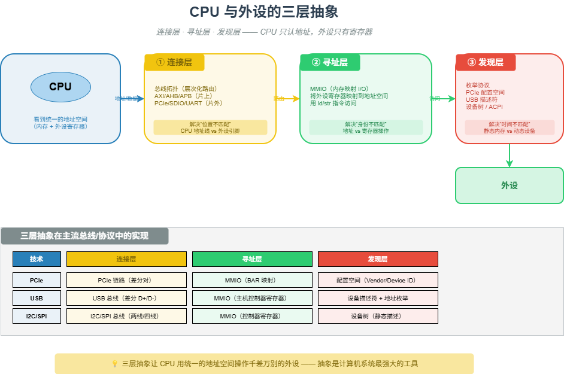

# M18 CPU 与外设的三层抽象

> CPU 只认地址，外设只有寄存器 —— 三层抽象（连接、寻址、发现）架起沟通的桥梁。

## 🧠 核心概念

CPU 的思维是“地址空间”，外设是物理实体。两者之间存在三个根本的“不匹配”，需要三层抽象来解决：

- **连接层**（位置不匹配）：CPU 地址线只通向内存控制器，外设引脚焊在 PCB 上。解决方案是总线拓扑（AXI/AHB/APB、PCIe/SDIO/UART），将地址空间的访问请求路由到正确的芯片引脚。
- **寻址层**（身份不匹配）：CPU 只认地址，外设只有寄存器。解决方案是内存映射 I/O（MMIO）或端口 I/O（PMIO），用不同的地址编码不同的操作意图。
- **发现层**（时间不匹配）：CPU 启动时不知道有哪些外设，外设可能随时插入/移除。解决方案是枚举协议（PCIe 配置空间、USB 描述符、设备树），让设备自我介绍。

这三层抽象共同实现了从“物理导线”到“逻辑设备”的转换，让 CPU 用统一的访存指令操作千差万别的外设。

## 🖼️ 图示

*上图展示了从 CPU 到物理外设的三层抽象：连接层（总线拓扑）、寻址层（MMIO）、发现层（枚举），并标注了 PCIe、USB、设备树等典型实现。*

## ⚙️ 如何应用

### 场景1：连接层（总线拓扑）
- **片上总线（AMBA）**：AXI（高性能，CPU↔DDR）、AHB（中等，USB 控制器）、APB（低功耗，UART/I2C/GPIO）。通过总线桥互连。
- **片外总线**：PCIe（高速，可枚举）、SDIO（中等带宽，Wi-Fi/蓝牙芯片）、UART（简单控制）、I2C/SPI（低速传感器）。
- **层次化结构**：SoC 内部总线 → 总线控制器 → 片外总线 → 外设芯片。每一级负责地址路由和协议转换。

### 场景2：寻址层（MMIO vs PMIO）
- **内存映射 I/O（MMIO）**：将外设寄存器映射到物理地址空间，CPU 用 `ldr/str` 指令直接访问。ARM、RISC-V、现代 x86 主流方式。
- **端口 I/O（PMIO）**：x86 专用，独立 I/O 地址空间（64KB），用 `in/out` 指令访问。用于遗留设备（如嵌入式控制器）。
- **MMIO 示例**：`/proc/iomem` 中可见 `f8800000-f88fffff : dwc3`（USB 控制器）。

### 场景3：发现层（枚举）
- **PCIe 枚举**：深度扫描总线上的 BDF（总线:设备:功能），读取配置空间的 Vendor ID/Device ID/Class Code，分配 MMIO 地址和中断号（MSI/MSI-X）。
- **USB 枚举**：检测端口电平变化，用地址 0 获取设备描述符（前 8 字节），分配新地址（1-127），再获取完整描述符，根据设备类加载驱动。
- **设备树（Device Tree）**：用于嵌入式（ARM/RISC-V），静态描述硬件拓扑、MMIO 地址、中断号、兼容字符串。驱动通过 `of_property_read_u32()` 等 API 获取配置。
- **ACPI**：x86 固件表，类似设备树，提供硬件配置信息。

### 场景4：三层抽象的协同工作
- **例：CPU 访问 USB 控制器**：
  1. 连接层：CPU 发出地址 `0xf8800000`，AXI 总线路由到 USB 控制器。
  2. 寻址层：该地址对应 USB 控制器的 MMIO 寄存器，CPU 读写该地址即控制 USB。
  3. 发现层：USB 控制器通过枚举发现插入的 U 盘，读取描述符，加载驱动。
- **例：CPU 访问 PCIe Wi-Fi 芯片**：
  1. 连接层：PCIe Root Complex 将内存访问转换为 PCIe 事务包。
  2. 寻址层：Wi-Fi 芯片的 BAR（基址寄存器）映射到 MMIO 区域。
  3. 发现层：系统启动时扫描 PCIe 总线，读取配置空间，匹配驱动。

### 场景5：为什么需要这三层？
- **没有连接层**：CPU 只能访问内存，无法与外设通信。
- **没有寻址层**：CPU 无法用统一指令操作外设，需要专用 I/O 指令或复杂协议。
- **没有发现层**：硬件配置硬编码（跳线帽、固定中断号），无法热插拔，无法动态加载驱动。

## 🔗 相关模型
- **M09 命名与寻址**：MMIO 本质上是将外设寄存器的“名字”映射到“地址”。
- **M15 分层**：三层抽象本身就是一种分层设计，每层封装一种不匹配。
- **M19 设备模型**：操作系统在枚举基础上构建设备对象和驱动匹配。

## 💬 思考题
1. 为什么 ARM 处理器没有独立的 I/O 地址空间（如 x86 的 `in/out`）？MMIO 的优缺点是什么？
2. PCIe 配置空间中的 BAR（基址寄存器）是如何被探测大小的？为什么能动态分配？
3. 设备树（Device Tree）和 ACPI 在功能上有何异同？为什么嵌入式系统偏爱设备树？

---
*创建日期：2026-04-19*  
*最后更新：2026-04-19*