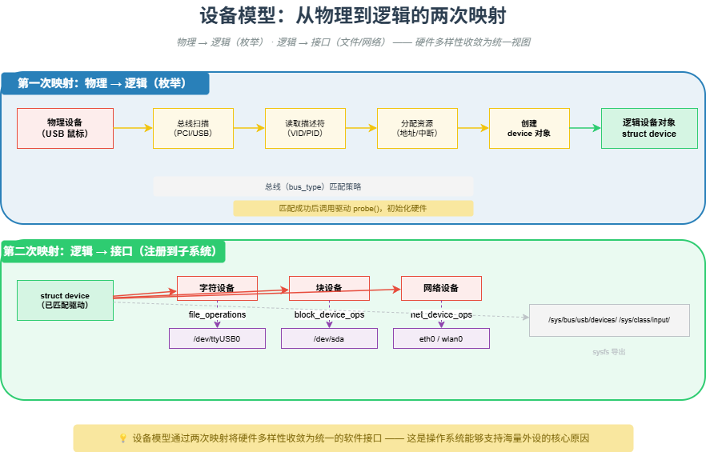

# M19 设备模型：从物理到逻辑的两次映射

> 物理→逻辑（枚举），逻辑→接口（文件/网络） —— 硬件多样性收敛为统一视图。

## 🧠 核心概念

操作系统管理设备的过程，可以概括为**两次映射**：

1. **物理 → 逻辑映射**：通过枚举（PCI/USB 总线扫描、设备树解析）将物理硬件转化为内核中的设备对象（`struct device`），并填充身份标识（VID/PID、兼容字符串）。
2. **逻辑 → 接口映射**：通过 `file_operations`、`net_device_ops` 等标准回调，将设备功能注册到 VFS（虚拟文件系统）、网络栈等子系统，最终暴露给用户空间为 `/dev/xxx`、`/sys/class/xxx`、网络接口等。

这两次映射实现了“硬件多样性”到“软件统一性”的收敛。无论是 USB 鼠标、I2C 触摸屏还是 PCIe 网卡，用户空间看到的都是标准的 `read`/`write`/`ioctl` 接口或网络套接字。

## 🖼️ 图示

*上图展示了从物理硬件到用户空间接口的两次映射过程，以及 Linux 设备模型中的总线-设备-驱动解耦。*

## ⚙️ 如何应用

### 场景1：第一次映射（物理→逻辑）
- **PCI 总线枚举**：扫描 BDF，读取配置空间（Vendor ID/Device ID/Class Code），创建 `pci_dev` 对象，分配资源（MMIO、中断）。
- **USB 枚举**：检测端口状态变化，用地址 0 获取设备描述符，分配唯一地址，读取完整描述符，创建 `usb_device` 对象。
- **设备树（Device Tree）**：解析 `.dtb` 文件，为每个节点创建 `platform_device`，设置 MMIO 地址、中断号、GPIO 等资源。
- **ACPI**：类似设备树，x86 平台通过 ACPI 表枚举硬件。

### 场景2：总线-设备-驱动解耦
- **总线（bus_type）**：定义匹配策略（`match` 函数）。如 USB 总线根据 VID/PID 或设备类匹配。
- **设备（device）**：代表物理或逻辑实体，包含资源信息。
- **驱动（device_driver）**：包含 `probe`/`remove` 回调及 ID 表。匹配成功后调用 `probe`，驱动在此处初始化硬件、申请中断、注册子设备。
- **策略模式**：匹配逻辑由总线驱动决定，设备驱动只声明“能匹配哪些设备”，实现关注点分离。

### 场景3：第二次映射（逻辑→接口）
- **字符设备**：驱动实现 `struct file_operations`（`open`/`read`/`write`/`ioctl`/`poll`），通过 `register_chrdev_region` + `cdev_add` 注册到 VFS。用户空间通过 `/dev/ttyS0` 等文件节点访问。
- **块设备**：驱动集成到通用块层，实现 `request_fn` 或 `blk_mq_ops`。用户空间通过 `/dev/sda` 进行读写，经过页缓存和 I/O 调度器。
- **网络设备**：驱动实现 `struct net_device_ops`，通过 `register_netdev` 注册。用户空间通过 `socket` API 操作，内核通过 `dev_queue_xmit` 等函数调用驱动。
- **sysfs**：设备层次结构在 `/sys/bus/`、`/sys/class/`、`/sys/devices/` 下呈现，供用户空间查询和配置。

### 场景4：实际案例（USB 鼠标）
1. **插入**：主机控制器检测电平变化，触发中断。
2. **枚举**：USB core 发送标准请求，获取设备描述符（类代码 0x03 = HID）。
3. **创建设备对象**：`usb_device` 被创建，添加到 USB 总线。
4. **匹配驱动**：`usb_match_device` 遍历 `hid` 驱动的 ID 表，匹配成功。
5. **probe**：`hid_probe` 初始化设备，申请中断，调用 `hid_add_device`。
6. **注册输入设备**：`hid` 核心创建 `input_dev`，注册到输入子系统。
7. **用户空间可见**：`/dev/input/mouse0` 出现，应用程序通过 `read` 获取鼠标事件。

### 场景5：设备模型的设计价值
- **动态插拔**：设备插入时自动创建对象、匹配驱动；移除时自动清理。
- **电源管理**：设备模型支持运行时电源管理（Runtime PM），引用计数为 0 时可挂起设备。
- **热插拔事件**：通过 `uevent` 通知用户空间（udev），用户可执行自定义规则（加载固件、创建符号链接、设置权限）。
- **驱动可加载**：驱动编译为模块，可在需要时动态加载，无需重新编译内核。

## 🔗 相关模型
- **M09 命名与寻址**：设备模型中的 `device` 对象就是“命名”，而 MMIO 地址、中断号等是“寻址”。
- **M15 分层**：设备模型是操作系统分层架构的关键部分，隔离了硬件差异。
- **M18 CPU 与外设的三层抽象**：设备模型建立在连接、寻址、发现三层抽象之上。

## 💬 思考题
1. 为什么 Linux 设备模型要引入“总线-设备-驱动”三者分离的设计？如果让驱动直接操作物理地址，会有什么问题？
2. udev 在用户空间的作用是什么？它如何与内核的设备模型交互？
3. 当你插入一个 USB 设备时，从物理电平变化到 `/dev/ttyUSB0` 的出现，中间经历了哪几次映射？

---
*创建日期：2026-04-19*  
*最后更新：2026-04-19*