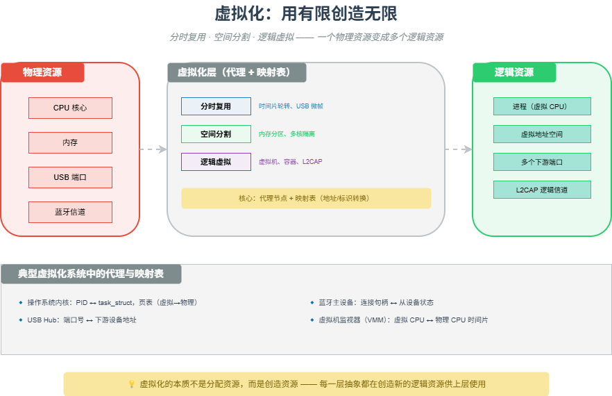

# M20 虚拟化：用有限创造无限

> 通过分时复用、空间分割或逻辑抽象，一个物理资源“变成”多个逻辑资源。

## 🧠 核心概念

虚拟化（Virtualization）与多路复用（Multiplexing）的本质，是在物理资源的有限性、确定性与逻辑需求的无限性、灵活性之间架设桥梁。实现方式有三种境界：

- **分时复用**：大家轮流使用，制造“同时”的假象（如 CPU 时间片、USB 微帧轮询）。
- **空间分割**：物理隔离，真正的并行（如内存分区、多核隔离、CAN 报文 ID 区分）。
- **逻辑虚拟**：协议转换，彻底的抽象（如虚拟机、容器、蓝牙 L2CAP 信道）。

每一层虚拟化都在创造一个新的“逻辑资源”供上层使用。例如：
- 操作系统在单个 CPU 上创造多个“虚拟 CPU”（进程）。
- USB Hub 在单个端口上创造多个“下游端口”。
- 蓝牙 L2CAP 在单个 ACL 链路上创造多个“逻辑信道”（CID）。

## 🖼️ 图示

*上图展示了从物理资源到逻辑资源的三种虚拟化方式（分时、空间、逻辑），以及 USB Hub、操作系统、蓝牙 L2CAP 中的典型代理-映射机制。*

## ⚙️ 如何应用

### 场景1：分时复用（时间维度）
- **操作系统进程调度**：单个 CPU 核心分时运行多个进程，每个进程以为自己独占 CPU。上下文切换保存/恢复状态。
- **USB 主机轮询**：主机控制器在微帧（125μs）内为多个端点分配时间片，制造“同时传输”的假象。
- **蓝牙微微网（TDMA）**：主设备为每个从设备分配特定时隙，所有从设备在同一跳频信道上分时通信。

### 场景2：空间分割（物理维度）
- **内存分区**：物理内存被划分为多个区域，分配给不同进程（通过 MMU/MPU），互不干扰。
- **多核隔离（AMP）**：将不同 CPU 核心分配给不同任务（如一个核心跑 RTOS 控制，另一个跑 Linux），实现硬隔离。
- **CAN 报文 ID**：不同 ID 的报文在总线上共存，通过标识区分（相当于逻辑上的“地址空间”）。

### 场景3：逻辑虚拟（协议转换与代理）
- **USB Hub 与事务转换器（TT）**：一个高速设备虚拟出多个低速/全速端口。主机看到 Hub，Hub 代理下游设备。TT 在高速微帧和低速帧之间做翻译和缓冲。
- **蓝牙 L2CAP**：在单一 ACL 链路上创建多个逻辑信道（CID 1~4096），供不同上层协议（RFCOMM、ATT、SMP）独立使用。信道复用通过协议头中的 CID 字段实现。
- **操作系统虚拟机（VMM）**：在物理硬件上虚拟出多个“完整计算机”，每个虚拟机有自己的 CPU、内存、设备。VMM 负责陷落和模拟特权指令。
- **容器（Docker）**：通过 Linux namespace（PID、net、mnt 等）和 cgroups 实现进程级隔离，共享同一内核，但看到独立的视图。

### 场景4：代理与映射表
所有虚拟化系统都有一个“代理”节点，维护映射表：
- **USB Hub**：映射表是“端口号 ↔ 下游设备地址”。
- **操作系统内核**：映射表是“PID ↔ 进程控制块 + 页表”。
- **蓝牙主设备**：映射表是“连接句柄 ↔ 从设备状态”。
- **MMU**：映射表是“虚拟页号 ↔ 物理页框号”（页表）。

### 场景5：不可能三角与虚拟化定位
虚拟化系统必须在 **隔离性、实时性、效率** 之间权衡：
- **强隔离 + 高效率**：USB 批量传输（但牺牲实时性）
- **强实时 + 弱隔离**：CAN 总线（优先级仲裁，但无地址隔离）
- **高效率 + 弱实时**：Wi-Fi CSMA/CA（公平竞争，延迟不确定）

## 🔗 相关模型
- **M05 多址接入**：FDMA/TDMA/CDMA 是虚拟化在物理层的体现。
- **M09 命名与寻址**：虚拟化中的映射表正是“名实映射”的实例。
- **M15 分层**：每一层虚拟化都在下层基础上创造新的逻辑资源。

## 💬 思考题
1. 操作系统进程调度属于哪种虚拟化方式？它创造了什么逻辑资源？
2. USB Hub 中的事务转换器（TT）是如何实现“速度域转换”的？它维护了什么映射表？
3. 容器和虚拟机在隔离程度上有什么区别？各自适用于什么场景？

---
*创建日期：2026-04-21*  
*最后更新：2026-04-21*