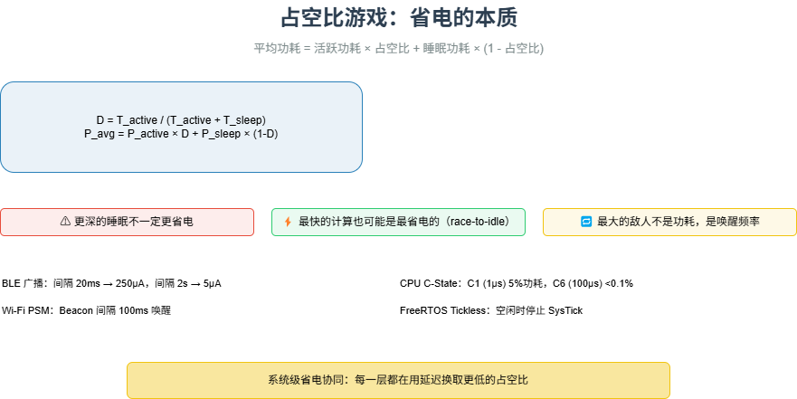

# M21 占空比游戏：省电的本质

> 平均功耗 = 活跃功耗 × 占空比 + 睡眠功耗 × (1 - 占空比) —— 降低占空比是省电的唯一出路。

## 🧠 核心概念

系统级省电的本质，不是降低活跃功耗（受工艺限制），而是**尽可能降低占空比**，让系统“绝大多数时间都在睡觉”。占空比 \( D = T_{\text{active}} / (T_{\text{active}} + T_{\text{sleep}}) \)。  
但睡眠不是免费的：从睡眠回到活跃需要**唤醒延迟**。你愿意等越久，就能睡越深、越省电。这就是**能量-延迟权衡曲线**。

三个反直觉的推论：

- **更深的睡眠不一定更省电**：如果空闲时间太短，进入深睡再醒来的能量开销（保存/恢复状态、重锁PLL）可能超过浅睡一直等的能量。这叫“睡眠开销过路费”。
- **最快的计算也可能是最省电的**：对于突发任务，用最高频率快速完成（race-to-idle），然后进入极深睡眠，总能耗往往低于降频慢慢跑。
- **最大的敌人不是功耗，是唤醒频率**：一颗芯片深度睡眠时可能只耗1µA，但如果每10ms被唤醒一次（哪怕只醒1ms），平均功耗约100µA，比1µA大了100倍。合并中断、延长轮询间隔、使用硬件offload这些减少唤醒次数的技术，往往比降低活跃功耗更有效。

## 🖼️ 图示

*上图展示了占空比公式、能量-延迟权衡曲线，以及BLE、Wi-Fi PSM、CPU C-State、FreeRTOS Tickless等典型案例。*

## ⚙️ 如何应用

### 场景1：无线通信的占空比参数
- **BLE 广播**：广播间隔20ms → 平均功耗250µA，发现延迟20ms；间隔2s → 功耗5µA，发现延迟2s。
- **BLE 连接**：连接间隔 + 从机延迟（Slave Latency）。间隔4s + 从延迟19 → 每80s响应一次，平均电流<2µA。
- **Wi-Fi PSM（省电模式）**：Station 按 Beacon 间隔（如100ms）醒来检查 TIM，无数据则立即睡去。延迟代价约一个 Beacon 周期。
- **Wi-Fi 6 TWT（目标唤醒时间）**：与 AP 协商唤醒时刻表，如每1s醒10ms，功耗降至几百µA，接近 BLE 水平。

### 场景2：CPU 的 C-State（睡眠等级）
- **C1**（HLT）：唤醒延迟 ~1µs，功耗约为活跃的1-5%。适用极短空闲。
- **C6**（深度睡眠）：唤醒延迟 ~100µs，功耗 <0.1%。适用空闲 >1ms。
- **target_residency**：进入该状态后至少应停留的时间，否则得不偿失。Linux `menu` governor 根据预测空闲时长选择。
- **PM QoS**：应用可设置最大允许唤醒延迟，限制 C-State 深度。

### 场景3：操作系统级省电
- **Tickless 内核**：空闲时停止周期性时钟中断，改为单次定时器，唤醒频率从1000Hz降到下一个事件频率。Linux `CONFIG_NO_HZ_IDLE`，FreeRTOS `configUSE_TICKLESS_IDLE`。
- **FreeRTOS Tickless 实现**：空闲任务计算 `xExpectedIdleTime`，配置低功耗定时器，停止 SysTick，进入睡眠。唤醒后补偿 tick 计数。
- **Cortex-M0 挑战**：24位 SysTick 限制最大睡眠时长（几十毫秒），需用独立低功耗定时器（如 RTC）实现长睡眠。

### 场景4：外设的自治省电
- **BLE 控制器**：可独立维持连接、定时唤醒，只在收到数据时才通过中断唤醒 CPU。
- **USB 选择性挂起**：OS 单独挂起空闲 USB 设备，防止其阻止 USB 控制器和 CPU 进入深睡。
- **硬件 offload**：Wi-Fi 芯片独立发送空数据包维持连接，CPU 无需干预。

### 场景5：系统级协同策略
- **应用层决策**：根据用户场景动态调整参数。例如：电池电量低时，将 BLE 广播间隔从1s延长到10s，牺牲发现速度换取待机时间。
- **延迟预算分配**：从应用层向下层分配可容忍的延迟，让每层选择最深的睡眠状态。
- **四层模型**：芯片架构层（C-State）→ 外设硬件层（BLE/Wi-Fi 占空比）→ 操作系统层（Tickless）→ 场景策略层（动态调参）。

## 🔗 相关模型
- **M12 中断 vs 轮询**：中断频率直接影响唤醒次数和占空比。
- **M14 实时性**：硬实时任务会限制可用的睡眠深度，增加占空比。
- **M11 缓存与队列**：队列可吸收突发，让 CPU 在空闲时进入更深的睡眠。

## 💬 思考题
1. 为什么 CPU 的 C6 状态不能在所有空闲时间都使用？什么情况下进入 C6 反而更耗电？
2. 一个 BLE 传感器，如果要求数据上报延迟 <100ms，你能把广播间隔设到 2s 吗？为什么？
3. 在 FreeRTOS 中启用 Tickless 模式后，`vTaskDelay(100)` 的实际延时可能比 100 个 tick 长还是短？为什么？

---
*创建日期：2026-04-21*  
*最后更新：2026-04-21*