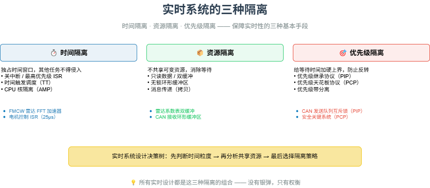

# M22 实时系统的三种隔离

> 时间隔离（独占窗口）、资源隔离（无锁/双缓冲）、优先级隔离（继承协议）—— 保障实时性的三种基本手段。

## 🧠 核心概念

实时系统设计的本质，是让关键任务在最坏情况下也能按时完成。所有保障实时性的技术，都可以归纳为三种隔离：

- **时间隔离**：为关键任务划定专属的时间窗口，在此期间其他任务（包括 RTOS 内核）不得侵入。典型手段：关中断、时间触发调度、CPU 核隔离（AMP）。
- **资源隔离**：让关键任务不与其他任务共享可变资源，从而消除等待。典型手段：只读数据、双缓冲、无锁环形缓冲区、消息传递（拷贝而非共享）。
- **优先级隔离**：当必须共享资源时，通过优先级继承或优先级天花板协议，确保等待时间有上界，且不被中优先级任务干扰。

这三种隔离对应着实时系统设计中的三个反直觉公理：
1. 实时 ≠ 快，实时 = 慢的边界可知（关注最坏情况执行时间 WCET）。
2. 任何共享资源都是潜在的时间炸弹（消除共享或加硬上界）。
3. 调度算法解决不了资源冲突，只能暴露它（必须与资源访问协议联合设计）。

## 🖼️ 图示

*上图展示了时间隔离、资源隔离、优先级隔离的核心机制，以及 CAN、FMCW 雷达、NFC、RTOS 等典型应用。*

## ⚙️ 如何应用

### 场景1：时间隔离
- **FMCW 雷达信号处理**：FFT 加速器为 Chirp 处理专用，其他任务无法抢占。Chirp 周期内必须完成，否则目标丢失。
- **磁悬浮电机控制（25µs 周期）**：控制算法在最高优先级定时器 ISR 中完成，不经过 RTOS 调度器，绕过任何软件开销。
- **时间触发调度（TT）**：静态时间片，无抢占。适用于多周期硬实时任务集（如航空电子）。
- **CPU 核隔离（AMP）**：将硬实时任务绑定到独立核心，其他核心运行 RTOS/Linux。

### 场景2：资源隔离
- **双缓冲**：雷达系数表更新时，修改非活跃副本，原子切换指针。FFT 任务始终读有效指针，无锁。
- **无锁环形缓冲区**：ISR 将 CAN 消息放入缓冲区，后台任务取出。单生产者单消费者，原子更新索引，避免阻塞。
- **只读数据**：初始化后不再修改，多任务可同时访问（如 FFT 旋转因子表）。
- **消息传递（拷贝）**：任务间通信通过队列拷贝数据，而非共享内存。适用于数据量小、频率低的场景。

### 场景3：优先级隔离
- **优先级继承协议（PIP）**：当高优先级任务等待低优先级任务持有的锁时，低优先级任务临时继承高优先级，防止被中优先级抢占。FreeRTOS、VxWorks 的互斥量默认支持。
- **优先级天花板协议（PCP）**：每个锁有预设的天花板优先级（等于可能使用该锁的最高优先级）。持锁任务提升至天花板，防止死锁，安全性更高。适用于安全关键系统。
- **优先级带分离**：硬实时任务使用独立优先级范围，不与软实时、后台任务混用，避免无意干扰。

### 场景4：综合案例——CAN 消息处理
- **时间隔离**：CAN 中断 ISR 极短（仅复制消息到环形缓冲区），高优先级消息（如刹车）映射为高优先级 RTOS 任务。
- **资源隔离**：接收路径用无锁环形缓冲区（ISR→任务）；发送路径无法完全无锁，使用互斥锁并启用优先级继承。
- **优先级隔离**：发送队列的互斥锁启用 PIP，防止高优先级发送任务被低优先级任务阻塞。

## 🔗 相关模型
- **M14 实时性**：时间即设计，隔离是实时性保障的核心手段。
- **M08 差错控制**：反馈模型中的超时重传也是一种时间补偿，而非隔离。
- **M11 缓存与队列**：无锁队列是实现资源隔离的重要工具。

## 💬 思考题
1. 为什么 FMCW 雷达的 FFT 必须用硬件加速器（时间隔离），而不能用软件任务实现？
2. 优先级继承与优先级天花板有何区别？在什么场景下必须使用天花板协议？
3. 举一个你熟悉的系统（如无人机飞控、自动驾驶域控制器）中三种隔离同时应用的例子。

---
*创建日期：2026-04-21*  
*最后更新：2026-04-21*